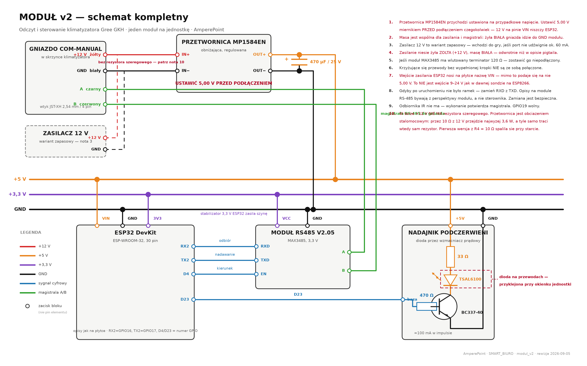
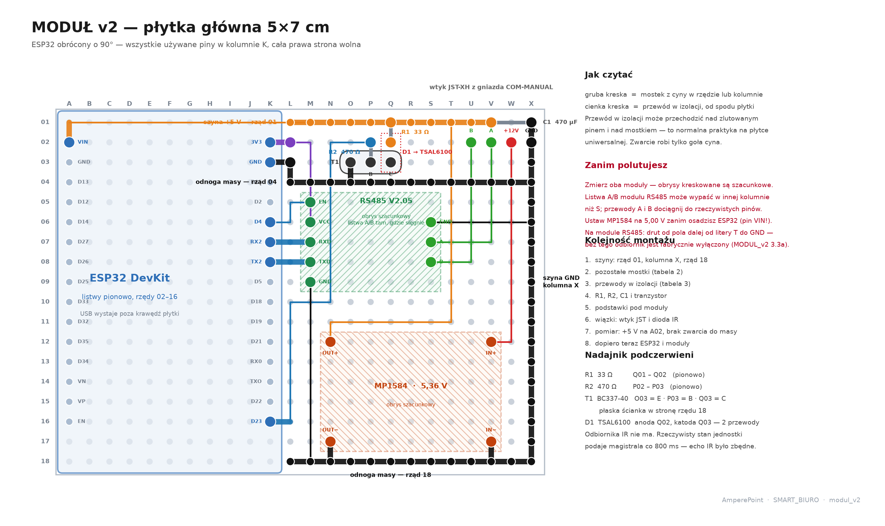

# Moduł v2 — dokumentacja kompletna

**Odczyt i sterowanie klimatyzatora Gree GKH(12)BB-K6DNA3A/I · jeden moduł na jednostkę · cztery sztuki**

Wersja 1 · 2026-09-01 · AmperePoint

Schemat połączeń: **`schemat_modul_v2.png`** w tym samym folderze — wszystkie połączenia
i zasilanie na jednym rysunku. Ten sam schemat jest osadzony niżej.

---

# 0. Schemat połączeń



Rysunek w pełnej rozdzielczości: `schemat_modul_v2.png` — powiększ w przeglądarce PDF
albo otwórz plik osobno, jeśli potrzebujesz szczegółów przy lutowaniu.

---

# 1. Co ten moduł robi

Każdy moduł obsługuje **jedną jednostkę** i realizuje dwie niezależne funkcje:

| Funkcja | Droga | Kierunek |
|---|---|---|
| **odczyt stanu** | magistrala RS-485 z portu COM-MANUAL | jednostka → moduł |
| **sterowanie** | podczerwień do okienka odbiornika jednostki | moduł → jednostka |

Rozdzielenie na dwie drogi nie jest wyborem estetycznym, tylko koniecznością:
**jednostka nie przyjmuje poleceń przez magistralę.** Rozgłasza swój stan co 800 ms i
ignoruje ramki od niezarejestrowanego sterownika — sprawdzono ponad 1100 wariantów ramek,
bez jednej odpowiedzi. Sterowanie musi więc iść podczerwienią, tak jak z pilota.

Zysk z połączenia obu dróg: **magistrala weryfikuje podczerwień**. Po każdej komendzie
moduł sprawdza na magistrali, czy jednostka faktycznie zareagowała, powtarza komendę przy
braku reakcji i zgłasza błąd, gdy nie skutkuje. Sam nadajnik podczerwieni jest ślepy i nie
dałby takiej pewności.

## 1.1 Co się zmienia wobec obecnej sondy

| Prowizorka dziś | Moduł v2 | Powód zmiany |
|---|---|---|
| bramka Modbus GRZ47-G użyta jako konwerter | układ **MAX3485** | mamy jedną bramkę, a modułów ma być cztery; znika dzielnik napięcia |
| programowy UART w ESP8266 | **sprzętowy UART** w ESP32 | koniec ramek z błędną sumą przy obciążeniu WiFi |
| dioda IR wprost z pinu, 13 mA | dioda przez **tranzystor**, ~100 mA | zasięg metrów zamiast dociskania diody do okienka |
| zasilanie z ładowarki USB | **przetwornica** z linii 12 V | moduł zamknięty w puszce, bez kabla na zewnątrz |
| dioda IR sterowana bezpośrednio z pinu | **BC337-40 + 33 Ω** | ok. 100 mA w impulsie zamiast kilkunastu — realny zasięg |

Ostatnia pozycja jest ważniejsza, niż wygląda. Dziś kody podczerwieni bierzemy z biblioteki
i wierzymy, że pasują. Odbiornik pozwoli odczytać je wprost z pilota i porównać — a przy
okazji sprawdzić, czy nadajnik w ogóle nadaje. Gdyby ten element był w układzie tydzień
temu, nie rozebralibyśmy sprawnego pilota, żeby zajrzeć w niego kamerą.

---

# 2. Wykaz elementów — jeden moduł

| Ozn. | Element | Rola | Pozycja listy zakupów |
|---|---|---|---|
| U1 | ESP32 DevKit, ESP-WROOM-32, 30 pin | sterownik | A1 |
| U2 | Moduł **RS485 V2.05** na MAX3485 (3,3 V) | RS-485 ↔ UART | A2 |
| U3 | Przetwornica MP1584EN | 12 V → 5,00 V | A3 |
| D1 | Dioda IR TSAL6100, 940 nm | nadajnik | A4 |
| Q1 | Tranzystor **BC337-40**, NPN | wzmacniacz prądu diody | A6 |
| C1 | Kondensator 470 µF / 25 V, low ESR | zbiornik energii na szynie 5 V | A7 |
| — | Płytka uniwersalna 5×7 cm | podłoże | A8 |
| — | Listwy goldpin 2,54 mm | gniazda pod U1 i U2 | A9 |
| J1 | Złącze JST-XH 2,54 mm, 4 pin | wtyk do gniazda COM-MANUAL | A10 |
| R1 | Rezystor 33 Ω | ogranicznik prądu diody IR | z zapasów |
| R2 | Rezystor 470 Ω | rezystor bazy Q1 | z zapasów |

Cztery moduły plus zapas — ilości w `..\LISTA_ZAKUPOW_ALLEGRO.pdf`.

---

# 3. Tabela połączeń

Do lutowania wygodniejsza niż rysunek — sprawdzaj wiersz po wierszu.

## 3.1 Gniazdo COM-MANUAL (wtyk J1)

| Żyła | Sygnał | Dokąd |
|---|---|---|
| **biała** | **GND** | do **IN−** przetwornicy U3 **oraz** do wspólnej masy modułu |
| **żółta** | **+12 V** | do **IN+** przetwornicy U3 |

> **Kolory zasilania są odwrotne, niż stało w tym dokumencie do 5 września 2026.**
> Pomiar oscyloskopem: czerwona sonda na białej, czarna na żółtej daje **−12 V**, czyli
> żółta jest 12 V *powyżej* białej. Przy masie oscyloskopu na białej ramki magistrali
> dekodują się czysto — a to znaczy, że układem odniesienia jest **biała**.

> **To tłumaczy całą wcześniejszą historię z zasilaniem.** Próba zasilenia sondy WeMos
> „z +12 V” podawała w rzeczywistości **odwrotną biegunowość**: plus na masę płytki,
> masę na wejście zasilania. Stąd klimatyzator, który nie startował, i dwa spalone
> rezystory szeregowe — one zjadały prąd zwarcia, a nie prąd pracy. Koncepcja
> „miękkiego startu przez rezystor” powstała jako lekarstwo na objaw błędu w opisie.

> **Kolor nie jest dowodem.** Trafiają się też wtyczki z inną kolejnością żył —
> 5 września taka wtyczka pokazała na białej linię sygnałową zamiast masy. Każdą nową
> wtyczkę zmierzyć: zasilanie to płaska kreska, sygnał ma impulsy.
| czarna | A | do pinu **A** modułu U2 |
| czerwona | B | do pinu **B** modułu U2 |

## 3.2 Zasilanie

| Od | Do | Uwaga |
|---|---|---|
| U3 **OUT+** | szyna **+5 V** | **najpierw ustawić 5,00 V** |
| U3 **OUT−** | szyna **GND** | |
| C1 **+** | szyna +5 V | biegunowość: pasek na obudowie = minus |
| C1 **−** | szyna GND | |
| szyna +5 V | U1 pin **VIN** | patrz ostrzeżenie 3.6 |
| szyna GND | U1 pin **GND** | |
| U1 pin **3V3** | szyna **+3,3 V** | ESP32 **zasila** tę szynę, nie pobiera z niej |

## 3.3 Magistrala — U1 ↔ U2

| ESP32 — opis na płytce | GPIO | Moduł RS485 V2.05 | Funkcja |
|---|---|---|---|
| **RX2** | 16 | **RXD** | wejście nadajnika modułu — nieużywane, moduł nigdy nie nadaje |
| **TX2** | 17 | **TXD** | **wyjście odbiornika modułu** → to tu przychodzą ramki; firmware czyta magistralę z **GPIO17** |
| **D4** | 4 | **EN** | włącznik **nadajnika** (tylko); trzymany nisko |
| szyna +3,3 V | — | **VCC** | |
| szyna GND | — | **GND** | |

Po stronie magistrali moduł ma osobną listwę: **GND, A, B**.

**Opisy `RXD`/`TXD` na tym module są z perspektywy modułu**, nie procesora: pole `TXD`
to wyjście odbiornika. Płytka jest zlutowana `RXD→RX2`, `TXD→TX2`, więc firmware czyta
magistralę z GPIO17 (`TX2`) — patrz 3.3a. Zmieniać nic nie trzeba.

## 3.3a Moduł RS485 V2.05 — trzy rzeczy, bez których nie odbiera

> **Korekta z 14 września 2026 (pomiary na module ze zdjęcia):** nóżka 2 (`RE`) i nóżka 3
> (`DE`) są ze sobą połączone i wychodzą razem na pin `EN` listwy; rezystor `103` podciąga
> ten węzeł do 3,3 V. Węzeł wysoko = nadajnik włączony, odbiornik wyłączony; nisko =
> odbiornik włączony, nadajnik wyłączony. Drut „z pola dalej od `T` do masy" działa,
> bo to pole jest tym węzłem; tak samo działa drut z końcówki `103` bliżej `T` albo
> z pinu `EN` listwy do `GND`. Punkty od strony zasilania (pole bliżej `T`, końcówka
> `103` dalej od `T`, pin `VCC`) do masy łączyć **nie wolno**. Rysunek z numeracją nóżek
> i schematem: `modul_v2/schemat_modul_rs485.png` (i `.pdf`). Opis poniżej zostawiam
> jako historię dochodzenia; wniosek praktyczny (węzeł do masy) jest ten sam.
> Dodatkowo: moduły z tej samej serii różnią się rezystorami polaryzującymi: `472`
> (4,7 kΩ) odbiera, `471` (470 Ω) nie odbiera ramek Gree. Mierzyć przed montażem.

Ustalone pomiarami 10 września 2026, po trzech modułach zachowujących się identycznie.

**1. Odbiornik jest fabrycznie wyłączony i nie da się go włączyć z listwy.** MAX3485 ma
osobne wejścia: `DE` (włącza nadajnik stanem wysokim) i `RE` (włącza odbiornik stanem
niskim). Na tym module pole `EN` idzie **tylko do `DE`**, a `RE` jest podciągnięte do
plusa przez rezystor `103` (10 kΩ) i nie wychodzi na listwę. Skutek: przy `EN` nisko układ
śpi, przy `EN` wysoko nadaje — **w żadnym stanie nie odbiera**. Wyjście odbiornika wisi
(podciągnięcie 45 kΩ w procesorze podnosi je do 100 %), co wygląda jak martwy układ.

Pomiary, które to rozstrzygnęły (moduł wyjęty z podstawki, sondy na jego polach):
pole obok litery `T` bliżej niej → `VCC` = **0,4 Ω** (to zasilanie); pole dalej od `T` →
`VCC` = **8,8 kΩ** (to noga `RE` przez 10 kΩ); między polami = 11 kΩ.

**Naprawa na module:** drut od **pola dalej od `T`** do pola **`GND`** listwy. Ściąga `RE`
do masy na stałe; przez 10 kΩ płynie 0,3 mA. **Nie** zwierać obu pól ze sobą (zwarłoby
tylko rezystor) i **nie** łączyć pola bliżej `T` z masą (to 3,3 V).

Test bez magistrali: `/diag`. Z włączonym nadajnikiem (punkt „kierunek WYSOKO")
wyjście odbiornika **musi podążać** za pinem nadawczym (pętla DI → A/B → odbiornik →
RO): to dowód, że moduł ma zasilanie, a nadajnik i odbiornik są włączone. Wyjście
odbiornika z podciąganiem w obie strony ma dać ten sam stan (`pullup=x pulldown=x`),
bo steruje nim układ; `pullup=1 pulldown=0` = wyjście wisi = odbiornik wyłączony
(drut nie działa).

**Poziom spoczynku bez magistrali nie jest kryterium.** Rezystory polaryzujące
modułu z terminatorem 120 Ω dają między A i B tylko ok. 20 mV (3,3 V · 120 / 20 120),
a układ potrzebuje 200 mV, żeby zdecydować. Moduł 1 spoczywa wysoko, moduł 2 nisko —
oba są sprawne; z wpiętą jednostką linię wymusza jej nadajnik. Wcześniejsze kryterium
„`/pin` → `GPIO17 TRZYMANY WYSOKO`" było błędne (poprawione 11 września 2026).

**2. Pole `TXD` to wyjście odbiornika.** Opisy są z perspektywy modułu. Po włączeniu
odbiornika linię trzymał pin 17 (`TX2`), nie 16. Firmware: `PIN_RX = 17`.

**3. Magistrala Gree w spoczynku trzyma wyjście odbiornika NISKO.** Bez magistrali
(same rezystory modułu) spoczynek jest wysoki; z wpiętą jednostką — 23 % czasu wysoko.
Port szeregowy wymaga spoczynku wysokiego, więc sygnał jest **odwracany** w odbiorniku.
Wniosek metodyczny: **polaryzacji nie da się ustalić bez podłączonej magistrali** — test
na biurku daje wynik odwrotny do prawdziwego.

Po tych trzech zmianach: 0 błędnych sum, 0 błędów bitu stopu, ramka co 800 ms.

---

## 3.4 Nadajnik podczerwieni

| Od | Do |
|---|---|
| szyna +5 V | R1 (33 Ω) |
| R1 | anoda D1 |
| katoda D1 | kolektor Q1 |
| emiter Q1 | szyna GND |
| **D23** (GPIO23) | R2 (470 Ω) |
| R2 | baza Q1 |

## 3.5 Przydział pinów ESP32 — uzasadnienie

| Opis na płytce | GPIO | Funkcja | Dlaczego ten |
|---|---|---|---|
| **TX2** | 17 | odbiór magistrali | wyjście odbiornika modułu (pole `TXD`); czytany **odbiornikiem programowym** z próbkowaniem 16×/bit, z odwróceniem — patrz 7.x |
| **D4** | 4 | kierunek RS-485 | wolny, bez roli przy starcie układu |
| **D23** | 23 | nadawanie IR | wolny, bez roli przy starcie |

Płytka opisuje piny **numerami GPIO poprzedzonymi literą D**, z wyjątkiem drugiego portu
szeregowego, który nosi nazwy **RX2** i **TX2**. Nie używaj **RX0/TXO** — to port USB,
przez który wgrywasz firmware.

Świadomie pominięto GPIO0, 2, 5, 12 i 15 — to piny konfiguracyjne, ich stan przy włączeniu
zasilania decyduje o trybie startu układu. Podłączenie do nich czegokolwiek grozi tym, że
moduł nie wystartuje.

## 3.5a NIGDY nie łącz USB i zasilania z VIN jednocześnie

**Na tej płytce ESP32 gniazdo USB i pin VIN są połączone bez diody blokującej.** Jeśli
moduł jest zasilany przez przetwornicę, a Ty wepniesz kabel USB do komputera, napięcie
z przetwornicy pójdzie **wprost do gniazda USB komputera**. Dopuszczalne maksimum na
magistrali USB to 5,25 V.

**5 września 2026 kosztowało to port USB w laptopie**, przy 6 V na wyjściu przetwornicy,
i najprawdopodobniej także pamięć programu w pierwszej kości ESP32 — przestała odpowiadać
tego samego dnia, po serii zdarzeń, w których to zestawienie wystąpiło.

Zasada bez wyjątków:

| Chcesz | Zrób |
|---|---|
| wgrać firmware | **odłącz zasilanie z przetwornicy**, potem USB |
| uruchomić moduł | **odłącz USB**, potem zasilanie z przetwornicy |
| odczytać log przy zasilaniu z przetwornicy | osobna przejściówka USB-UART, **tylko RX, TX i masa — bez żyły zasilania** |

**Osadź ESP32 w podstawce, nie lutuj go na stałe.** Pierwszy egzemplarz był wlutowany
i jego wymiana wymagała wylutowania czterdziestu wyprowadzeń.

---

## 3.6 Pułapka nazewnictwa: pin VIN

Na tej płytce ESP32 **nie ma pinu opisanego „5V"**. Wejście zasilania nosi nazwę **VIN** —
i to jest najgroźniejsze miejsce w całym montażu, bo w poprzedniej sondzie pin o tej samej
nazwie przyjmował 9–24 V.

| Płytka | Pin | Dopuszczalne napięcie |
|---|---|---|
| WeMos D1 R1 (dawna sonda) | VIN | **9–24 V** |
| ESP32 DevKit (moduł v2) | VIN | **5 V** — za nim siedzi stabilizator 3,3 V |

**Podanie 12 V na VIN modułu v2 niszczy płytkę.** Przetwornica MP1584 musi być ustawiona
na 5,00 V, zanim cokolwiek do niej podłączysz.

---

# 4. Zasilanie

Pełny rachunek: `..\ZASILANIE_OBLICZENIA.pdf`, rozdziały 12, 14 i 15. Tutaj streszczenie.

## 4.1 Skąd bierze się napięcie

```
  +12 V z gniazda COM-MANUAL  ──[ 10 Ω ]──►  MP1584  ──►  5,00 V  ──►  moduł
       (wariant docelowy)                        ▲
                                                 │
  zasilacz 230 V → 12 V  ─────────────────────────
       (wariant zapasowy)
```

Oba warianty kończą się tak samo — na wejściu przetwornicy. Różni je tylko źródło.
**Docelowo zasila port**; zasilacz wchodzi do gry, jeśli port nie udźwignie poboru.

## 4.2 Bilans

| Odbiornik | Pobór z szyny 5 V |
|---|---|
| ESP32 z WiFi, średnio | 80–120 mA |
| MAX3485 | ok. 1 mA |
| dioda IR | ok. 100 mA, wyłącznie w impulsach po ~70 ms |
| **razem, średnio** | **100–130 mA, czyli 0,5–0,65 W** |
| **pobór z linii 12 V przez przetwornicę** | **ok. 60 mA** |

Dla porównania: obecna sonda pobiera z linii **150 mA** i to jej pobór blokował start
jednostki. Przetwornica zbija tę wartość dwuipółkrotnie — na tym polega cała nadzieja
wariantu docelowego.

## 4.3 Rzecz, która niszczy moduł

**Do pinu `VIN` ESP32 nigdy nie wolno podać 12 V.** Za tym pinem siedzi stabilizator 3,3 V;
przy 12 V musiałby zutylizować 8,7 V, a ESP32 w szczycie nadawania pobiera do 250 mA —
to ponad 2 W w małej obudowie.

Uwaga jest niebanalna, bo **obecna sonda znosi 12 V bez problemu**: WeMos D1 R1 ma wejście
VIN przewidziane na 9–24 V. **Na obu płytkach ten pin nazywa się tak samo**, a znosi
zupełnie inne napięcia — patrz 3.6.

## 4.4 Marginesy elementów

| Element | Wytrzymałość | Obciążenie | Zapas |
|---|---|---|---|
| MP1584, wejście | 4,5–28 V | 12 V | w środku zakresu |
| MP1584, prąd wyjścia | 3 A | 0,13 A | **23×** |
| kondensator C1 | 25 V | 5 V | **5×** |
| stabilizator 3,3 V ESP32 | ok. 0,5 W ciągłe | 0,2 W średnio | wystarcza |
| tranzystor Q1 | 800 mA | 100 mA | **8×** |
| dioda D1 | 100 mA ciągłe | 100 mA impulsowo | praca impulsowa, w normie |

Żaden element nie pracuje blisko granicy.

## 4.5 Skąd wzięły się wartości rezystorów

**R1 = 33 Ω** — ogranicznik prądu diody:
R = (5 V − 1,35 V spadku na diodzie − 0,2 V na nasyconym tranzystorze) ÷ 0,1 A ≈ 34 Ω.
W impulsie traci 0,33 W, ale nośna 38 kHz ma około połowy wypełnienia, a paczka trwa
~70 ms — moc średnia jest pomijalna, element 0,25 W wystarcza.

**R2 = 470 Ω** — rezystor bazy:
I_B = (3,3 V − 0,7 V) ÷ 470 Ω ≈ 5,5 mA, przy dopuszczalnych 12 mA z pinu ESP32.
Przy wzmocnieniu BC337 rzędu 100 daje to pełne nasycenie przy 100 mA kolektora.

**Odbiornika podczerwieni nie ma.** Rzeczywisty stan jednostki podaje magistrala co
800 ms, więc to ona potwierdza wykonanie komendy — echo własnego nadajnika niczego nie
wnosiło, a kody z pilota są niepotrzebne, skoro skutek ich naciśnięcia i tak widać na
magistrali. **GPIO19 zostaje wolny**; gdyby odbiornik miał kiedyś wrócić, wystarczy
mostek `K11 → L11` i trzy przewody.

### Dlaczego w torze +12 V nie ma rezystora

W pierwszej wersji stał tam R4 = 10 Ω jako „ogranicznik udaru". **Spalił się przy
pierwszym uruchomieniu.**

**Przyczyna: odwrotna biegunowość, wynikająca z błędu w tym dokumencie.** Do 5 września
2026 tabela 3.1 podawała białą jako +12 V, a żółtą jako masę — czyli odwrotnie, niż jest
naprawdę. Montaż szedł według tej tabeli, więc przetwornica dostała zasilanie odwrotnie,
zaczęła przewodzić przez własne diody i wyglądała jak zwarcie. Wtedy prąd ogranicza już
tylko sam rezystor: 12 V / 10 Ω = **1,2 A**, czyli **14,4 W** — pięćdziesiąt osiem razy
powyżej ćwierci wata. Stąd „spalił się od razu".

Tę samą przyczynę miały dwa wcześniejsze rezystory (47 Ω i 22 Ω) w sondzie WeMos oraz to,
że **klimatyzator nie startował** z podłączoną sondą. Jeden odwrócony wiersz w tabeli
kolorów, trzy spalone rezystory i cała porzucona koncepcja „miękkiego startu".

### Dlaczego mimo to nie wraca

Rezystor byłby tam zbędny nawet przy prawidłowej biegunowości, a przy tej wartości wręcz
uniemożliwiałby rozruch. Policzyłem był tylko stan ustalony: 57 mA, spadek 0,57 V, strata
0,033 W. Liczba jest poprawna, ale nie mówi nic o tym, czy układ potrafi do tego stanu
**dojść**.

Przetwornica impulsowa jest obciążeniem **stałomocowym**: gdy napięcie na jej wejściu
spada, pobiera *więcej* prądu, a nie mniej. Z rezystorem szeregowym daje to sprzężenie
dodatnie. Moc przechodząca przez rezystor do przetwornicy wynosi

```
P = I · (12 − 10·I)
```

czyli parabolę z maksimum przy I = 0,6 A. **Przez 10 Ω z 12 V nie przejdzie więcej niż
3,6 W**, a w tym punkcie sam rezystor traci drugie tyle — czternaście razy powyżej
swojego ćwierćwatowego zakresu.

Równanie ma przy tym **dwa rozwiązania**. Dla mocy 0,65 W są to 57 mA (strata 0,033 W)
oraz **1,14 A (strata 13 W)**. Oba są poprawne matematycznie i nic nie każe układowi
wybrać tego pierwszego.

Sufit 3,6 W dotyczy jednak **pracy ustalonej**, gdy przetwornica reguluje wyjście.
W czasie miękkiego startu ona nie reguluje, tylko rozpędza wypełnienie po rampie, a prąd
ogranicza ta rampa i wewnętrzny limit prądu — nie żądanie mocy. Szacunek „naładowanie
470 µF w 2 ms wymaga 1,18 A, czyli ok. 7 W" jest więc **górnym ograniczeniem
zapotrzebowania, a nie przewidywaniem**: w rzeczywistości napięcie na wejściu siada,
rampa zwalnia i układ albo startuje wolniej, albo wchodzi w cykliczne restarty.
Czasu miękkiego startu tego egzemplarza nie zmierzyłem, więc **nie rozstrzygam, która
z tych dwóch rzeczy by nastąpiła**.

Ten wątek nie jest zresztą potrzebny do decyzji — patrz niżej.

**Decyzja o usunięciu rezystora opiera się na dwóch rzeczach, z których żadna nie zależy
od zachowania przy starcie:**

1. **Nie rozwiązuje żadnego istniejącego problemu.** Udar, przed którym miał chronić, to
   naładowanie kondensatora wejściowego przetwornicy: ½ · 10 µF · 12² = **0,72 mJ**,
   trwające mikrosekundy. Przed nadmiernym prądem w pracy chroni sama przetwornica, bo ma
   **własne ograniczenie prądu i własny miękki start**.
2. **Jako zabezpieczenie jest złym elementem.** Przy przeciążeniu nie rozłącza obwodu,
   tylko się grzeje — zanim przepali się na przerwę, robi się czerwony. Od rozłączania jest
   bezpiecznik albo bezpiecznik polimerowy. Żyła żółta idzie teraz prosto
do IN+, a biała na IN− i na wspólną masę modułu.

Gdyby pomiar w teście 4 wykazał, że port COM-MANUAL nie znosi udaru przy wpinaniu,
właściwym elementem jest **bezpiecznik polimerowy (PTC)**, który przy przeciążeniu
rozłącza obwód i wraca sam — a nie rezystor, który przy usterce zamienia się w grzałkę.

---

# 5. Montaż

## 5.1 Kolejność, która nie wybacza zmian

1. **Ustawić przetwornicę na 5,00 V** — zasilić ją samą z 12 V, zmierzyć wyjście
   miernikiem, dokręcić potencjometr. **Do niczego jeszcze nie podłączać.**
2. Wykonać trzy szyny: **rząd 01** (+5 V), **kolumna X** (GND), **rząd 18** (odnoga masy).
3. Wykonać pozostałe mostki — tabela 2 w `rozklad_polaczenia.md`.
4. Poprowadzić przewody w izolacji od spodu — tabela 3.
5. Wlutować **C1** (uwaga na biegunowość kondensatora).
6. Wlutować podstawki goldpin pod ESP32 i moduł RS485 — mają dawać się wyjąć bez lutownicy.
7. Wlutować wiązkę do wtyku J1 (U02–X02) i dwa przewody diody (Q02, Q03).
8. Sprawdzić omomierzem, że **między szyną +5 V a GND nie ma zwarcia**.
9. Sprawdzić miernikiem, że na otworze **A02** jest **5,00 V**, zanim osadzisz ESP32.
10. Dopiero teraz osadzić ESP32 i moduł RS485 w podstawkach.

## 5.1a Rozkład na płytce



Siatka odpowiada opisom na płytce: kolumny **A–X**, rzędy **01–18**. Grube kreski to
**mostki z cyny**, cienkie to **przewody w izolacji od spodu**. Komplet połączeń otwór
po otworze jest w osobnym pliku `rozklad_polaczenia.md` — do odhaczania przy lutowaniu.

### Dlaczego ESP32 stoi pionowo

To jedyna decyzja, którą warto tu uzasadnić, bo przesądza o całej reszcie.

Moduł ma trzydzieści pinów w dwóch listwach oddalonych o dziesięć podziałek. Położony
**poziomo** zajmuje kolumny A–O i rzędy 08 oraz 18, czyli piętnaście na jedenaście pól
z dwudziestu czterech na osiemnaście. Zostają dwie osobne wyspy: pasek u góry (rzędy
01–07) i blok po prawej (kolumny P–X). Każdy sygnał idący z jednej wyspy na drugą musi
przejść przez **rząd 08 — piętnaście zlutowanych pinów listwy**. Nie ma tam wolnego
otworu, przez który dałoby się przeprowadzić przewód.

Postawiony **pionowo** zajmuje kolumny A i K, rzędy 02–16. Wszystkie siedem używanych
wyprowadzeń — `3V3`, `GND`, `D4`, `RX2`, `TX2`, `D23` — wypada wtedy w **kolumnie
K**, która przylega bezpośrednio do pustego prostokąta L–X × 01–18. Żaden przewód nie
przechodzi przez listwę. Jedyny wyjątek to `VIN`, który zostaje po drugiej stronie
w **A02**: jeden przewód rzędem 01, pod modułem.

Cena tej orientacji: moduł ma 52 mm, a płytka w tym kierunku 46 mm, więc gniazdo USB
wystaje poza krawędź przy rzędzie 18. To akurat wygoda — wtyczka jest dostępna bez
rozbierania obudowy.

### Co z tego wynika

**Moduł RS485 siada dokładnie naprzeciw pinów UART.** Przy listwie `EN VCC RXD TXD GND`
w kolumnie M, rzędy 05–09, wypada:

| Połączenie | Jak wykonać |
|---|---|
| RXD (M07) → RX2 (K07) | **mostek z cyny** przez L07 |
| TXD (M08) → TX2 (K08) | **mostek z cyny** przez L08 |
| EN (M05) → D4 (K06) | przewód M05 → L05 → L06 → K06 |
| VCC (M06) → 3V3 | przewód M06 → M02 → L02 |
| GND (M09) → masa | przewód M09 → M18 |

Dwa najważniejsze połączenia magistrali robisz kroplą cyny, bez ani jednego przewodu.

**Cały tor nadawczy siedzi na płytce głównej.** Na przewodach zostaje tylko sama
dioda — musi być przyklejona naprzeciw okienka jednostki, więc i tak nie ma dla niej
miejsca w skrzynce:

| Element | Otwory |
|---|---|
| R1 33 Ω | **Q01 – Q02**, pionowo; Q01 leży na szynie +5 V |
| R2 470 Ω | **P02 – P03**, pionowo |
| T1 BC337-40 | **O03** = E, **P03** = B, **Q03** = C |
| dioda TSAL6100 | anoda **Q02**, katoda **Q03** — dwa przewody |
| emiter → masa | mostek **O03 → O04** na odnogę masy |
| D23 → R2 | przewód **L16 → L10 → N10 → N02 → P02** |

**Szyny zasilania:** +5 V w **rzędzie 01** (L→V), GND w **kolumnie X** (02→18) oraz dwie
odnogi masy — w **rzędzie 04** (L→X, dla emitera tranzystora) i w **rzędzie 18** (L→X,
przy przetwornicy).

## 5.1b Czego ten rysunek nie rozstrzyga

**Obrysy modułu RS485 i przetwornicy są szacunkowe** — nie zmierzyłem żadnego z nich.
Przyłóż je do płytki i policz otwory, zanim polutujesz.

| Element | Co sprawdzić | Co zrobić, jeśli wyjdzie inaczej |
|---|---|---|
| RS485 V2.05 | odstęp listwy `EN…GND` od listwy `GND/A/B` | przesunąć obrys; przewody A i B (poz. 19 i 20) dociągnąć do rzeczywistych pinów — reszta rozkładu tego nie dotyka |
| MP1584 | rozstaw IN↔OUT i rozstaw pinów w parze | przesunąć w wolnym polu N–V, rzędy 11–17 |
| C1 470 µF | rzeczywisty rozstaw nóżek | przy 3,5 mm wstawić w V01/W01 i dodać mostek W01 → X01 |

**Dwa przewody świadomie przechodzą nad zlutowanym punktem:** VCC modułu RS485 (poz. 18)
nad pinem EN, a masa procesora (poz. 15) nad mostkami w L07 i L08. To przewody
w izolacji, prowadzone od spodu — zwarcie na płytce uniwersalnej robi tylko goła cyna.
Nie jest to niedopatrzenie rysunku.

### Wyprowadzenia BC337-40 — nie zgaduj

**Baza to zawsze środkowa nóżka.** Skrajne zależą od producenta i tu czai się pułapka:
**BC337 ma odwrotną kolejność niż BC547**, mimo że oba są NPN w TO-92.

| Element | Płaską ścianką do siebie, nóżki w dół |
|---|---|
| BC547 / BC548 | C – B – E |
| **BC337 / BC338** (ON Semi, Fairchild) | **E – B – C** |

Katalogowa numeracja BC337 to `1 = emiter, 2 = baza, 3 = kolektor`, licząc od lewej przy
płaskiej ściance zwróconej do patrzącego. Ale drugie źródła bywają zlutowane inaczej,
więc **sprawdź swój egzemplarz**, zamiast wierzyć tej tabeli:

1. Miernik w trybie **diody**. Czerwona sonda na środkową nóżkę, czarna kolejno na obie
   skrajne — w obu przypadkach ma pokazać ok. **0,6–0,75 V**. To potwierdza, że masz NPN
   i że środkowa nóżka to baza. Po odwróceniu sond: brak przewodzenia w obie strony.
2. Rozróżnienie C od E miernikiem jest niepewne (złącze B-E daje zwykle o kilkadziesiąt
   miliwoltów więcej niż B-C), więc zrób **próbę czynnościową**: zwykła dioda LED
   z rezystorem 330 Ω z +5 V do domniemanego kolektora, domniemany emiter na masę,
   10 kΩ z +3,3 V do bazy. Świeci jasno — orientacja dobra. Świeci ledwo albo wcale —
   masz C z E zamienione.

**Pomyłka nie niszczy tranzystora.** Przy zamienionych C i E układ pracuje w trybie
odwrotnym: przewodzi, ale ze wzmocnieniem rzędu 2–5 zamiast 250, więc dioda IR świeci
śladowo. Napięcie na złączu B-E nie przekracza 3,3 V, czyli zostaje poniżej napięcia
przebicia ok. 5 V — wystarczy wylutować i obrócić.

Nóżki trzeba rozgiąć do 2,54 mm, żeby weszły w **O03, P03, Q03**. Ponieważ otwory idą
na rysunku od lewej do prawej, a kolejność czyta się od płaskiej ścianki, tranzystor musi
stać **płaską ścianką zwróconą w stronę rzędu 18** (w dół rysunku, ku modułowi RS485),
grzbietem do szyny +5 V w rzędzie 01.

## 5.2 Umiejscowienie w jednostce

| Element | Gdzie | Dlaczego |
|---|---|---|
| płytka modułu | w skrzynce elektrycznej klimatyzatora | zamknięta, bez kabli na zewnątrz |
| dioda D1 | **przyklejona naprzeciw okienka odbiornika** | TSAL6100 ma wąską wiązkę i wymaga celowania |

Umiejscowienie diody jest krytyczne i wynika z doświadczenia: pierwszy udany test
sterowania powiódł się dopiero, gdy dioda dotykała okienka odbiornika. Z tranzystorem
zasięg będzie znacznie większy, ale kierunek nadal ma znaczenie.

## 5.3 Bezpieczeństwo

- Wpinanie i wypinanie wtyku z gniazda COM-MANUAL **wyłącznie przy wyłączonym bezpieczniku**.
- W skrzynce jednostki jest 230 V, a czynnik R32 jest palny — bez iskrzenia przy jednostce.
- W wariancie z zasilaczem: podłączenie do zacisków 230 V przy wyłączonym bezpieczniku,
  zaciski zasilacza zaizolowane.

---

# 6. Uruchomienie — kryteria zaliczenia

Wykonać **na jednym module**, przed montażem pozostałych trzech.

| # | Test | Kryterium zaliczenia | Gdy nie przechodzi |
|---|---|---|---|
| 1 | napięcie na wyjściu przetwornicy | 4,95–5,05 V | poprawić potencjometrem |
| 2 | moduł startuje i łączy się z WiFi | widoczny w sieci | sprawdzić zasilanie i lutowanie |
| 3 | odczyt magistrali | ramki co 800 ms, błędne sumy poniżej 1% | sprawdzić polaryzację A/B |
| 4 | **napięcie linii +12 V pod obciążeniem** | **≥ 11 V** | przejść na wariant zapasowy |
| 5 | **trzykrotne przełączenie bezpiecznika** | **jednostka wstaje za każdym razem** | przejść na wariant zapasowy |
| 6 | komenda podczerwienią | magistrala potwierdza zmianę w ciągu 15 s | poprawić celowanie diody |
| 7 | temperatura po godzinie pracy | elementy letnie, nie parzące | sprawdzić napięcie przetwornicy |

**Testy 4 i 5 są rozstrzygające dla całej koncepcji zasilania.** Ich niepowodzenie nie
przekreśla projektu — oznacza tylko przejście na zasilacz, który jest już sprawdzony.

---

# 7. Oprogramowanie

**Gotowe.** Źródło: `firmware\modul_v2\modul_v2.ino` w tym folderze.
Kompiluje się bez ostrzeżeń: 83% pamięci programu, 16% pamięci dynamicznej.

## 7.1 Co się zmieniło wobec sondy v10

| Element | Sonda v10 (ESP8266) | Moduł v2 (ESP32) |
|---|---|---|
| odbiór magistrali | programowy UART, ok. 9% ramek z błędną sumą | **sprzętowy UART2** |
| pamięć nastaw | EEPROM z ręczną sumą kontrolną | **NVS** (`Preferences`) |
| strażnik pamięci | próg na największym spójnym bloku | próg na wolnej stercie |
| tryby diagnostyczne | fala, skan pinów, przemiat 24 protokołów | **usunięte** — służyły do problemów już rozwiązanych |

## 7.2 Echo nadajnika — test niezależny od klimatyzatora

Najważniejsza nowa funkcja. Po każdej wysyłce moduł **włącza własny odbiornik i sprawdza,
czy usłyszał to, co przed chwilą nadał**. Rozstrzyga to pytanie, na które przez tydzień
nie mieliśmy odpowiedzi: czy dioda w ogóle świeci.

| Echo | Potwierdzenie z magistrali | Wniosek |
|---|---|---|
| słychać | tak | wszystko działa |
| słychać | nie | nadajnik sprawny, **problem z celowaniem** w okienko jednostki |
| cisza | nie | **usterka toru diody** — tranzystor, rezystor, lutowanie |

Bez tego rozróżnienia każda awaria wyglądała tak samo. Testu kamerą telefonu, który nas
zmylił, nie trzeba już nigdy robić.

## 7.3 Interfejs sieciowy

Adresy `/stan` i `/ustaw` działają **identycznie jak w v10**, więc karta panelu w Home
Assistancie nie wymaga żadnych przeróbek. Doszły tylko nowe pola JSON:

| Pole | Znaczenie |
|---|---|
| `ir_ostatni_protokol` | protokół ostatniego kodu odebranego z pilota |
| `ir_ostatni_kod` | ten kod zapisany szesnastkowo |
| `modul` | nazwa egzemplarza, żeby odróżnić cztery moduły |
| `temp_procesora_c` | temperatura krzemu ESP32. Stabilizator 3,3 V siedzi obok procesora: przy 5 V na `VIN` traci ok. 0,2 W, przy 12 V ok. 0,9 W, więc procesor zasilany z źle ustawionej przetwornicy jest wyraźnie cieplejszy niż ten sam moduł na USB. 11 września 2026: moduł 2 z przetwornicy 56,7 °C, moduł 3 na USB 53,3 °C — różnica 3 °C, czyli przetwornica w porządku |

## 7.4 Komendy przez telnet (port 23)

| Komenda | Działanie |
|---|---|
| `INFO` | adres, czas pracy, pamięć, liczniki ramek |
| `IR ON` / `IR OFF` | włącz / wyłącz jednostkę |
| `IR TEMP 24` | nastawa 16–30 |
| `IR TRYB cool` | `cool` / `heat` / `dry` / `fan` / `auto` |
| `IR WENT 2` | `auto` / `1` / `2` / `3` |
| `RESET` | restart modułu |

## 7.5 Wgrywanie

**Pierwszy raz — kablem USB**, bo aktualizacja przez WiFi wymaga działającego firmware'u:

```
arduino-cli compile --fqbn esp32:esp32:esp32 --build-property "compiler.cpp.extra_flags=-DMODUL_NR=2" --output-dir build2 firmware\modul_v2
arduino-cli upload  --fqbn esp32:esp32:esp32 -p COMx --input-dir build2
```

Kolejne aktualizacje przez WiFi, bez zdejmowania modułu z sufitu:

```
espota.exe -i <IP modułu> -I <IP laptopa> -p 3232 -f build2\modul_v2.ino.bin -r
```

Brak komunikatu **nie** oznacza sukcesu: po ~15 s `/stan` ma pokazać `uptime_s`
poniżej 40 (moduł się zrestartował z nowym programem). Bez `-I` z adresem laptopa
moduł nie odpowiada na zaproszenie.

## 7.6 Cztery egzemplarze — jedna rzecz do zmiany

Numer egzemplarza podaje się **przy kompilacji**, źródło jest jedno dla wszystkich:

```
--build-property "compiler.cpp.extra_flags=-DMODUL_NR=2"
```

Bez tej flagi powstaje `modul-gree-1`. W źródle:
`NAZWA_OTA = "modul-gree-" MODUL_STR(MODUL_NR)`.

Ta nazwa jest jednocześnie adresem dla aktualizacji przez WiFi, treścią rozgłoszenia
w sieci i polem `modul` w JSON-ie. **Cztery moduły o tej samej nazwie będą się gryzły.**

Moduł rozgłasza po sieci co 2 s pakiet `MODUL-GREE <nazwa> <adres IP>` na porcie UDP 4210 —
dzięki temu znajdziesz go nawet po zmianie adresu przez router.

| Egzemplarz | Jednostka | MAC | Adres z DHCP (11 IX 2026) |
|---|---|---|---|
| `modul-gree-1` | biuro | `28:05:A5:30:F7:F8` | 192.168.0.249 |
| `modul-gree-2` | hala północ | `D4:E9:F4:70:ED:B0` (ESP wymienione 14 IX po południu; poprzednie `28:05:A5:2F:64:5C`) | 192.168.0.186 (od 14 IX 16:50; wcześniej .129, .130) |
| `modul-gree-3` | hala płn.-zach. | `28:05:A5:2F:92:04` | 192.168.0.214 |

Adresy są z DHCP; do rezerwacji w UniFi (Client Devices → klient → Settings → Fixed IP
Address). Home Assistant odpytuje moduły po adresie, więc zmiana adresu = utrata
encji do czasu poprawki w `configuration.yaml`.

---

## 7.w Zamiar po pustej pamięci — przejmowany z magistrali

Nowy procesor po pierwszym wgraniu ma pustą pamięć nastaw, a domyślny zamiar to
**„wyłączony, 22 °C, chłodzenie"**. Każda **częściowa** komenda — sam bieg, sama
temperatura — wysyła pilotem *cały* zestaw, więc gasiłaby jednostkę. Tak właśnie
10 września `IR WENT 3` wyłączyło klimatyzator (potwierdzone magistralą: wentylator
„stoi"); przywrócono jedną pełną komendą `/ustaw?wl=1&temp=18&tryb=cool&went=2`.

Od tej pory, **jeśli nastawy nie zostały wczytane z pamięci**, moduł przejmuje zamiar
z pierwszej poprawnej ramki: `włączony ⇔ wentylator ≠ 0`, bieg z kodu ramki
(`04` niski, `02` średni, `01` wysoki). Ten sam krok wykonuje się tuż przed obsługą
`/ustaw`, gdyby komenda przyszła przed pierwszą ramką. Log: `[NASTAWY] zamiar przejety
z magistrali: …`. Po pierwszej komendzie nastawy trafiają do pamięci i przejmowanie
nie jest już potrzebne. Temperatury nastawy magistrala nie podaje — zostaje 22 °C do
pierwszej pełnej komendy z Home Assistanta.

Ścieżka uruchamia się wyłącznie przy pustej pamięci, więc na tym egzemplarzu (pamięć
już zapisana) nie została wykonana; zadziała na kolejnym module przy pierwszym starcie.

## 7.w2 Granica potwierdzania: tryb grzania

Potwierdzenie rozkazu (`obsluzWeryfikacje`) porównuje z magistralą tylko dwie rzeczy:
czy jednostka pracuje (bieg ≠ 0) i, w trybach chłodzenie/wentylacja/grzanie, czy bieg
zgadza się z zadanym. W **trybie grzania** jednostka Gree po włączeniu trzyma wentylator
wewnętrzny wyłączony, dopóki wymiennik się nie nagrzeje (ochrona przed zimnym nawiewem),
więc na magistrali przez dłuższy czas jest bieg 0 i moduł zgłasza „**nie**", choć rozkaz
doszedł (jednostka zapiszczała). 14 września 2026 tak wyglądała „niedziałająca" hala
zachód: po przełączeniu na chłodzenie potwierdzenia były natychmiastowe. Do zrobienia:
w trybie grzania potwierdzać inaczej (np. zmianą temperatury wymiennika) albo wydłużyć okno.

## 7.x Odbiornik programowy magistrali

Sprzętowy UART2 nie jest używany do odbioru. Magistralę czyta **przerwanie zegarowe co
52 µs** (16 próbek na bit przy 1200 bd): bit startu = co najmniej 6 z 8 ostatnich próbek
nisko; wartość każdego bitu = **głosowanie 9 próbek** wokół jego środka; bit stopu
musi wyjść wysoki, inaczej bajt jest odrzucany i odbiornik czeka na spoczynek. Sygnał
jest odwracany (`mkOdwroc = 1`), bo jednostka trzyma linię nisko w spoczynku.

Powstał jako odbiornik odporny na szpilki, gdy linia wisiała (wisiała, bo odbiornik
w module był wyłączony — 3.3a). Po naprawie linia jest czysta (najkrótszy odcinek
831 µs, zero szpilek) i sprzętowy UART z `invert=true` też by działał; odbiornik
programowy zostaje, bo ma 0 błędów i daje liczniki diagnostyczne.

Pola w `/stan`: `mk_starty`, `mk_bajty`, `mk_bledy_stopu`, `mk_odwroc`. Punkty
diagnostyczne (tylko odczyt): `/diag` (procesor sam wymusza stany na pinie nadawczym
i kierunku, a czyta odbiorczy — rozstrzyga zasilanie modułu, włączenie odbiornika
i mostki między `RX2` a `TX2`), `/linia[?pullup=1]` (stan linii 3 s), `/pin` (czy piny
16/17/4 są sterowane z zewnątrz), `/bity` (rozkład długości odcinków), `/zrzut` (surowe
bajty z bufora), `/surowe` (odcinki L/H w µs od pierwszego zbocza), `/mk?odwroc=0|1`
(polaryzacja + zerowanie liczników), `/kierunek?stan=0|1`. Punkty nadające na
magistralę (`/echo`, `/nadawaj`) są **wyłączone** — moduł nigdy nie nadaje do jednostki.

**Port sprzętowy UART2 nie jest nigdy włączany** (od 11 września 2026). Pin nadawczy
(`RX2`, GPIO16) jest wejściem na stałe, a po każdej diagnostyce `przywrocPiny()`
ustawia oba piny danych jako wejścia i kierunek nisko. Powód: wcześniej `/linia`,
`/pin` i `/bity` na końcu włączały UART, a ten robi z pinu nadawczego wyjście w stanie
wysokim. Na płytce modułu 2 sieci `RX2` i `TX2` są zwarte mostkiem cyny (modułu RS485
nie da się wyjąć bez uszkodzenia podstawki), więc pin nadawczy nadpisywał wyjście
odbiornika i odbiór stawał aż do restartu. Z pinem nadawczym jako wejściem mostek nie
ma skutku: siecią steruje wyłącznie wyjście odbiornika, a procesor ją tylko czyta.
Koszt: żaden — moduł z założenia nie nadaje po RS485. `/diag` nadal pokazuje ten
mostek w punkcie 1; to informacja, nie warunek montażu.

**Strażnik zawieszenia** (od 11 września 2026): pętla główna musi zgłaszać się
co najmniej raz na 90 s, inaczej procesor restartuje się sam (`esp_task_wdt`). Powód:
moduł „hala północ" zawiesił się pod sufitem z zapaloną diodą zasilania i zgaszoną
niebieską; bez strażnika zawieszenie oznacza drabinę, ze strażnikiem półtorej minuty
dziury w danych. 90 s, bo najdłuższa diagnostyka (`/bity`, `/zrzut`) blokuje pętlę na
5 s; na czas wgrywania po WiFi (blokuje pętlę na kilkadziesiąt sekund) strażnik jest
zdejmowany w `ArduinoOTA.onStart`. Objaw zawieszenia od zewnątrz: brak sygnału UDP,
brak odpowiedzi HTTP, dioda niebieska zgaszona przy świecących diodach zasilania.

---

# 7z. Lista kontrolna dla modułu nr 2 (te same części)

Kolejność wynika z tego, co 5–10 września 2026 kosztowało najwięcej. Żaden punkt nie
wymaga innych części niż kupione.

**Zanim cokolwiek trafi na płytkę**
1. **Kolory żył każdej nowej wtyczki zmierzyć**, nie zakładać: zasilanie to płaska
   kreska, sygnał ma impulsy. Trafiła się wtyczka z inną kolejnością. Docelowo:
   biała = masa, żółta = +12 V, czarna = A, czerwona = B.
2. **ESP32 zaprogramować przez USB na gołej płytce** — skompilować z `-DMODUL_NR=2`
   (7.6), nic w źródle nie zmieniać. Na pierwszym starcie sprawdzić w logu
   `[NASTAWY] zamiar przejety z magistrali` (ta ścieżka nigdy nie była wykonana).
3. **Na module RS485 V2.05: drut od pola dalej od litery `T` do pola `GND` listwy**
   (3.3a). Bez tego odbiornik jest fabrycznie wyłączony. Pole bliżej `T` to VCC.
4. **Przetwornicę ustawić na 5,00 V** na własnym zasilaczu, bez obciążenia, przed
   wlutowaniem. Sprawdzić ponownie w otworze podstawki pod pinem `VIN`.

**Montaż**
5. **Podstawki** pod ESP32 i pod moduł RS485 — obie wymiany były przez nie możliwe.
6. **Szyny z gołego drutu**, lutowane tylko w punktach przyłączeń; cyna spaja co
   najwyżej dwa sąsiednie pola. Grot ścięty, 330–350 °C, topnik.
7. Płytka **bez rezystora szeregowego** w torze +12 V — żyła żółta prosto na IN+.
8. **Odciążenie kabla** opaską kilka centymetrów od lutów; wzmocnić luty żył
   z wtyczki. Przerywany styk pod ciężarem kabla kosztował godzinę.
9. Przewód masy magistrali `S06 → X06` (poz. 20 listy) — brakował w pierwszym rozkładzie.
10. Tranzystor płaską ścianką w stronę rzędu 18: E–B–C od lewej (BC337 ≠ BC547).

**Uruchomienie — w tej kolejności, każdy krok da się cofnąć**
11. **Nigdy USB i zasilanie z VIN naraz** (3.5a). Wgrywanie: przetwornica odłączona.
12. Na własnym zasilaczu, procesor wyjęty: 5,00 V w otworze `VIN`. Potem procesor.
13. Bez magistrali: `/diag`. Punkt 2 (kierunek wysoko) musi dać `DI=0 -> RO=0;
    DI=1 -> RO=1` — pętla zwrotna, czyli moduł zasilany, nadajnik i odbiornik włączone.
    Punkt 3 ma dać `pullup=x pulldown=x` (wyjście odbiornika steruje);
    `pullup=1 pulldown=0` = drut z pkt 3 nie działa. **Poziom spoczynku (0 czy 1) nie
    jest kryterium** (3.3a). Punkt 1 z „RO PODAZA" przy kierunku nisko = mostek
    `RX2`–`TX2`: usunąć, jeśli da się bez wyjmowania modułu; firmware go toleruje (7.x).
    Brak pętli zwrotnej w punkcie 2 przy dobrym punkcie 3 (`pullup=x pulldown=x`) =
    nadajnik się nie włącza (przewód `D4` → `EN`) **albo A zwarte z B** po stronie
    magistrali; omomierz między A i B ma pokazać ok. 120 Ω (terminator), nie 0.
    Pierwsze jest nieszkodliwe (moduł nie nadaje), drugie uniemożliwia odbiór.
14. Z magistralą: `/stan` → `ramek_ok` rośnie o ~1,25/s, `ramek_zla_suma` = 0,
    `mk_bledy_stopu` nie rośnie. Polaryzacji **nie** oceniać bez magistrali.
15. Pierwsza komenda **wyłącznie pełna**: `/ustaw?wl=1&temp=…&tryb=cool&went=…`.
    Nigdy sam bieg ani sama temperatura na świeżym module.
16. Rezerwacja DHCP w UniFi dla MAC modułu, potem wpis w Home Assistancie.

**Diagnostyka, gdy „nic nie odbiera"** — w tej kolejności, żadnego oscyloskopu na drabinie:
`/pin` (czy wyjście modułu steruje linią) → `/linia` (spoczynek wysoko/nisko z magistralą)
→ `/bity` (najkrótszy odcinek ≈ 833 µs = czysta linia) → `/zrzut` (surowe bajty).

---

# 8. Co pozostaje nierozstrzygnięte

| Kwestia | Stan |
|---|---|
| **czy port udźwignie 60 mA** | nieznane; 150 mA blokowało start, progu nie znamy — rozstrzygają testy 4 i 5 |
| rozstaw wtyku JST | przyjęto XH 2,54 mm na podstawie tego, że wtyk pasował do gniazda programatora — do potwierdzenia miarką |
| który protokół IR zadziałał | sterowanie działa na protokole Gree (wariant YAW1F) — potwierdzone w polu, bo jednostka wykonuje komendy |
| terminator na module RS485 | jeśli wlutowany — zostawić niepodłączony; magistrala jest krótka i wolna (1200 bps) |
| kierunek RXD/TXD na module RS485 | **rozstrzygnięte 2026-09-10**: `TXD` = wyjście odbiornika, firmware czyta GPIO17; `RE` modułu zwarte do masy drutem — patrz 3.3a |

---

# 9. Dokumenty powiązane

| Dokument | Zawartość |
|---|---|
| `schemat_modul_v2.png` | **schemat połączeń — ten sam folder** |
| `..\ZASILANIE_OBLICZENIA.pdf` | pełny rachunek zasilania, historia trzech nieudanych podejść |
| `..\LISTA_ZAKUPOW_ALLEGRO.pdf` | wykaz zakupów z linkami, sprawdzona dostępność |
| `..\FAZA2_USTALENIA.pdf` | dlaczego magistrala nie przyjmuje poleceń |
| `..\DEKODOWANIE_POSTEP.pdf` | mapa pól ramki rozgłoszeniowej |
| `..\panel\README.pdf` | karta panelu w Home Assistancie |
