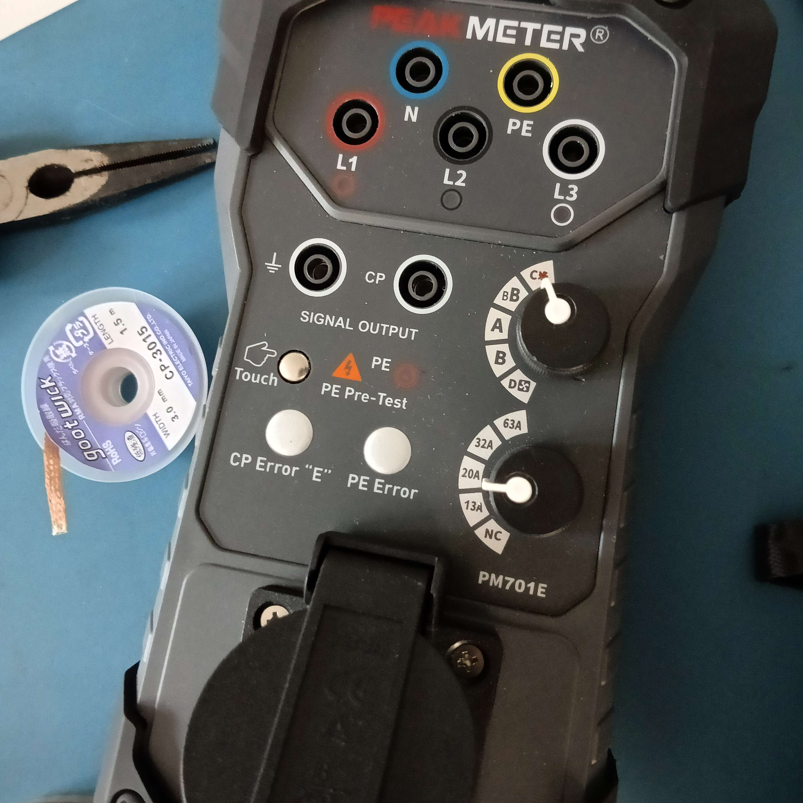
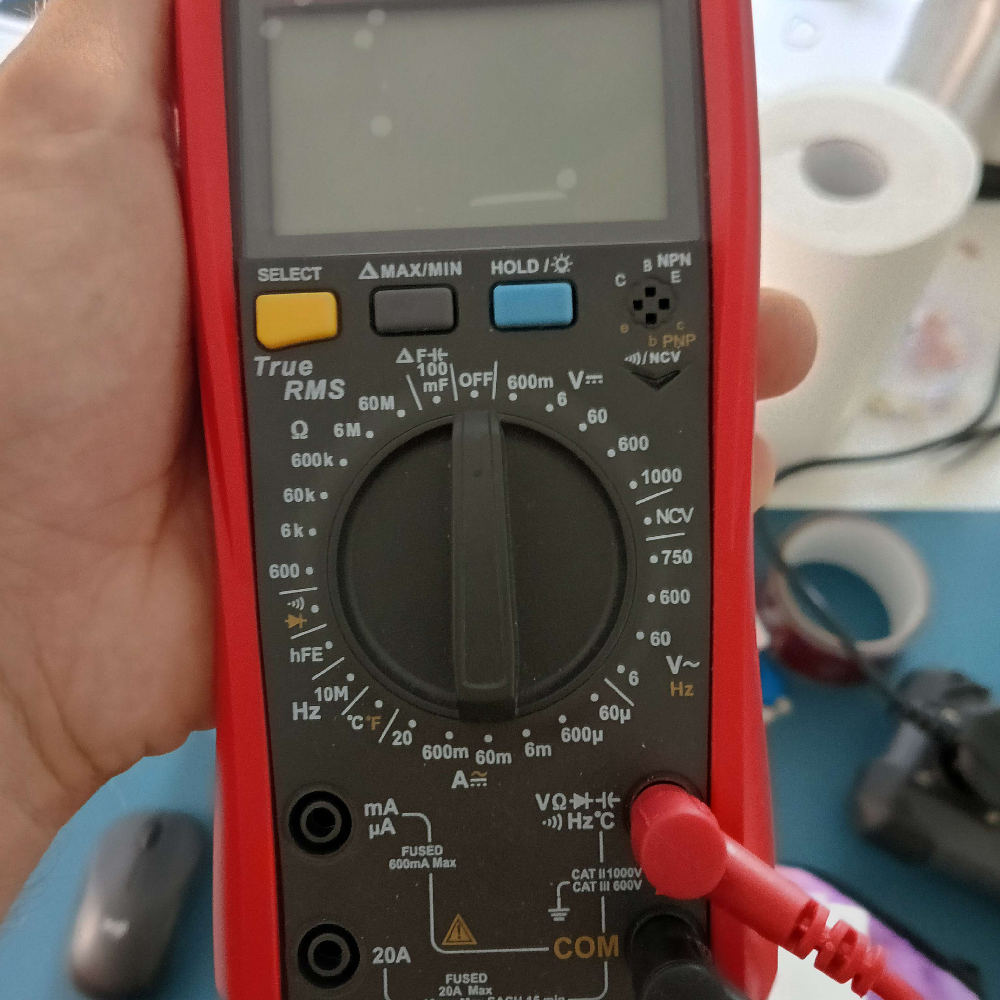
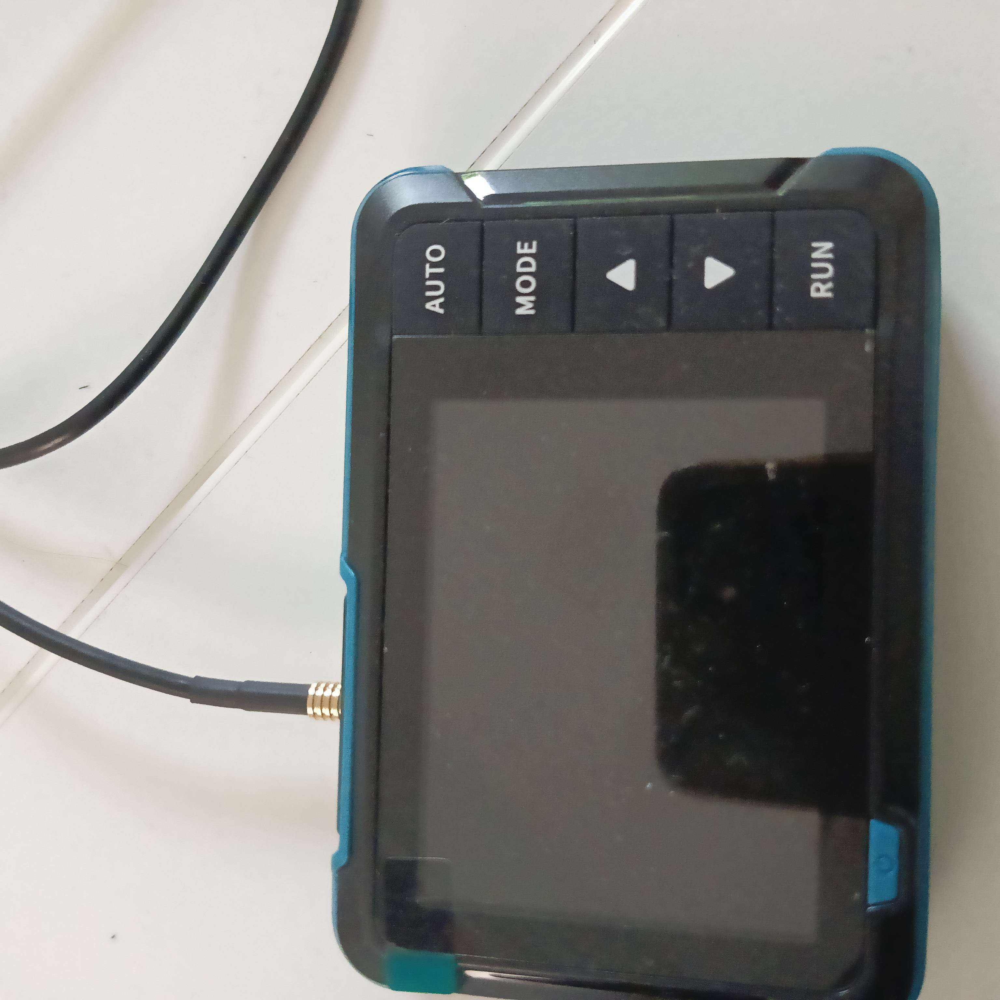
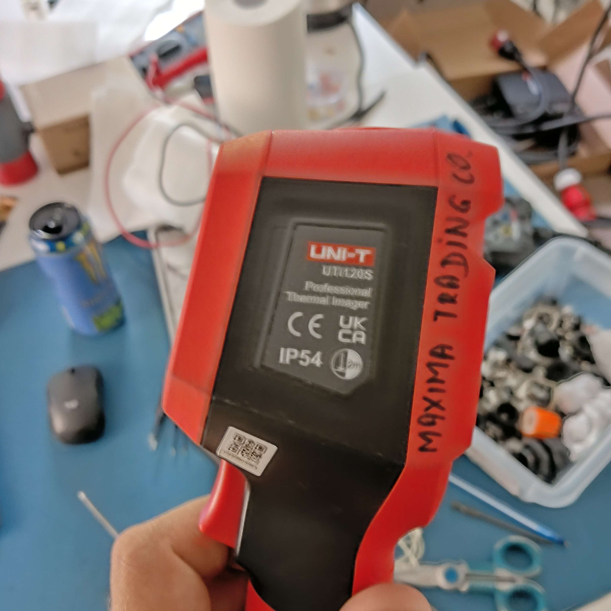
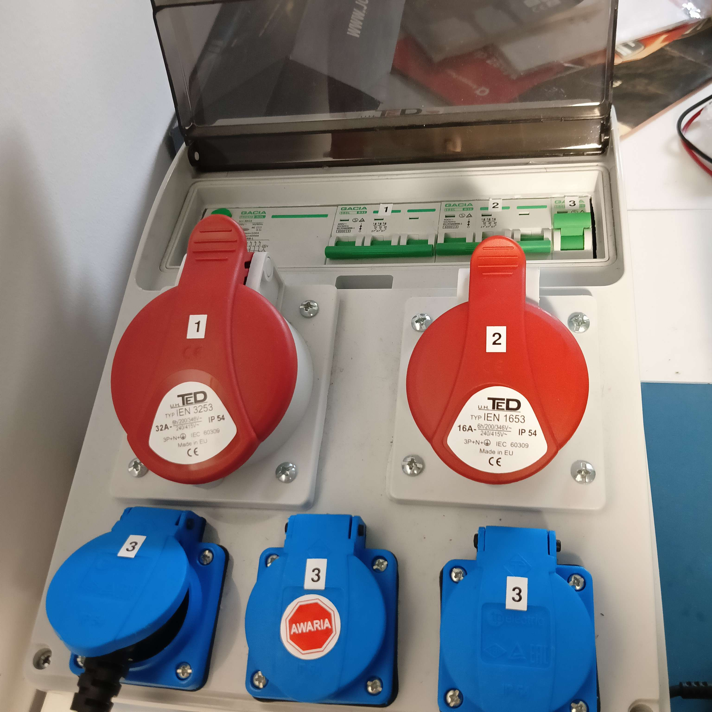

# CUSTOM DEVICE — informacje i przekazanie kontekstu
**AMPERE POINT · projekt wielofunkcyjnego urządzenia pomiarowego (custom device) · stan: 2026-07-03**

> **Jak użyć:** wklej treść tego pliku na początku nowej rozmowy w Cowork (z podpiętym folderem `AMPERE_POINT`), aby odtworzyć pełny kontekst tematu „custom device" i kontynuować dyskusję. To osobny, trzeci wątek AMPERE POINT — odrębny od czatu diagnostyki i od czatu integracji Q/Tuya/HA (patrz `aparatura_pomiarowa/aparatura_pomiarowa_inf.md`, ten plik jest jego rozwinięciem/kontynuacją).

---

## 1. Cel projektu i zasada nadrzędna
**Główny cel:** opracowanie pełnego projektu **wielofunkcyjnego urządzenia pomiarowego**, dzięki któremu będzie można wykonać **wszystkie pomiary z przewodnika** (patrz pkt 3). Priorytet: **spójna koncepcja i praktyczna wykonalność** — urządzenie ma docelowo powstać jako realny, fizyczny sprzęt, nie tylko projekt papierowy.

Docelowo urządzenie ma umożliwić **testowanie wszystkiego bez użycia samochodu EV**. Obecnie zakład ma samochód testowy, ale to rozwiązanie tymczasowe/pomocnicze — nie ma być wymogiem do wykonywania pomiarów czy testów.

**Zasada nadrzędna — spójność na poziomie realnych połączeń hardware.** Każdy blok koncepcji (pkt 4) musi dać się opisać nie tylko funkcjonalnie („moduł X mierzy Y"), ale na poziomie konkretnych złączy, przewodów i sygnałów. To warunek, żeby architektura była wewnętrznie spójna i żeby dało się ją później 1:1 przenieść na schemat elektryczny (pkt 5).

**Status po weryfikacji z 2026-07-03 (pkt 6):** cztery kluczowe decyzje zakresu zostały rozstrzygnięte przez Dawida — projekt idzie w stronę **pełnej automatyzacji przez mechaniczne przełączanie** (nie tylko ręcznej obsługi, i nie przez elektroniczny bypass PM701E), **pełnego modułu obciążenia 1-fazowego i 3-fazowego**, oraz **pełnego pokrycia RCD typu B/6mA DC**. To realnie zwiększa zakres i złożoność projektu względem pierwotnie najprostszej wersji — sekcje poniżej są already zaktualizowane pod ten zakres.

## 2. Materiały do opracowania projektu
Materiały źródłowe (dokumentacja, noty aplikacyjne, zdjęcia posiadanego sprzętu, datasheety komponentów itp.) trafiają do tego samego folderu — `custom_device/` — obok niniejszego pliku informacyjnego.

**Otrzymane zdjęcia (2026-07-03):** `tester.jpg` (PeakMeter PM701E), `multimetr.jpg`, `mikrooscyloskop.jpg`, `kamera_ir.jpg`, `obudowa.jpg` (wzór stylistyczny obudowy — patrz pkt 4.3). Wykorzystane w pkt 4.3 i pkt 9.

## 3. Pięć obowiązkowych pomiarów (wg przewodnika) — do pokrycia przez urządzenie
Podstawa merytoryczna: „Przewodnik w zakresie wykonywania pomiarów elektrycznych stacji ładowania" (Warszawa 2024) — plik `Przewodnik_pomiary_stacji_ladowania.pdf` (folder główny `AMPERE_POINT`). Do pomiarów 1, 2, 4, 5 na stacji konieczny jest adapter EVSE, bo wprowadza ją w status C (stan „ładuje auto") i daje dostęp do żył L/N/PE.

1. **Ciągłość przewodów ochronnych** — prąd probierczy ≥200 mA; przez wyjście PE adaptera; kryterium: niska rezystancja.
2. **Rezystancja izolacji** — napięcia 250/500/1000 V DC; min. 1 MΩ; 250 V dla obwodów z elektroniką/gniazdami; żyły czynne można zewrzeć i mierzyć względem PE (ochrona elektroniki).
3. **Rezystancja uziemienia roboczego** — metoda techniczna 3-elektrodowa (szpilkowa), elektrody E/S/H, ~20 m; „o ile stosowane" (dot. własnego uziomu — układ TT lub lokalny pręt).
4. **Sprawdzenie RCD** — przez adapter w statusie C; typ (AC/A/B/F), czas i prąd zadziałania, napięcie dotyku U_B.
5. **Skuteczność ochrony (impedancja pętli Zs)** — warunek Zs·Ia ≤ Uo; czasy wyłączenia z tabeli (TN/TT).

To jest twardy wymóg funkcjonalny dla custom device: urządzenie musi umożliwiać wykonanie wszystkich pięciu powyższych pomiarów.

## 4. Koncepcja urządzenia (zaktualizowana po decyzjach z 2026-07-03)
Zarys architektury po rozstrzygnięciu pytań Q1–Q4 z pkt 6. Nadal robocza w szczegółach doboru komponentów, ale zakres jest już ustalony.

### 4.1 Rdzeń przetwarzający
Sercem urządzenia jest mikroprocesor/mikrokontroler (np. z rodziny **ESP32**). Odpowiada za: sterowanie sekwencją pomiarową, sterowanie automatyką PM701E (pkt 4.2), sterowanie modułem obciążenia (pkt 4.4), akwizycję CP i danych z modułów analogowych, logikę bezpieczeństwa (blokady kolejności testów), UI, zapis wyników, komunikację WiFi.

**Uwaga na skalę projektu po decyzji Q1/Q3:** przy pełnej automatyzacji (serwomechanizmy — mechaniczne przełączanie pokręteł PM701E) i pełnym module obciążenia (styczniki/SSR na realnych prądach do 32 A/fazę) liczba wyjść sterujących i wymagania bezpieczeństwa rosną istotnie względem wersji „tylko pomiarowej". Sam ESP32 wystarczy jako warstwa logiki/UI, ale **przełączanie realnych obciążeń mocy powinno iść przez osobny, sprzętowy obwód bezpieczeństwa** (np. przekaźniki bezpieczeństwa / stycznik główny rozłączany też mechanicznie, nie tylko programowo) — mikrokontroler nie powinien być jedyną barierą między „coś poszło nie tak w kodzie" a „pod napięciem zostaje coś, co nie powinno". To nowy, ważny punkt do uwzględnienia w projekcie szczegółowym (pkt 11).

### 4.2 Automatyzacja sterowania PM701E (decyzja Q1: pełna automatyzacja — mechaniczne przełączanie)
PM701E ma dwa pokrętła ręczne: **stanu (BB/C/A/B/D)** i **prądu (NC/13A/20A/32A/63A)** — patrz `tester.jpg`, pkt 9. Wybrano pełną automatyzację zamiast obsługi ręcznej, realizowaną przez **mechaniczne przełączanie** — fizyczne działanie na istniejących pokrętłach zewnętrznym mechanizmem, bez ingerencji w elektronikę wewnętrzną przyrządu. Wariant z elektronicznym bypassem wewnętrznego przełącznika (patrz niżej) został **odrzucony** na rzecz podejścia mechanicznego.

**Sposób realizacji — mechaniczne przełączanie (ustalone):** dwa mikroserwomechanizmy zamocowane mechanicznie na osiach obu pokręteł, sterowane przez MCU (PWM), fizycznie obracające pokrętła PM701E do zadanej pozycji — bez ingerencji w elektronikę wewnętrzną przyrządu (nie trzeba go otwierać/modyfikować, więc PM701E zachowuje swoją gwarancję/kalibrację). Wymaga: (a) kalibracji kąt serwa ↔ pozycja pokrętła (pięć pozycji na pokrętle stanu, pięć na pokrętle prądu — dyskretne kroki, nie zakres ciągły), (b) mechanicznego adaptera/uchwytu sprzęgającego oś serwa z pokrętłem (element do zaprojektowania, np. drukowany 3D), (c) potwierdzenia, że pokrętła PM701E dają się swobodnie obracać zewnętrznym momentem bez uszkodzenia mechanizmu.

**Odrzucona alternatywa (elektroniczna, dla porządku):** rozbudowa/bypass wewnętrznego przełącznika obrotowego PM701E i zastąpienie go przekaźnikami sterowanymi bezpośrednio przez MCU — wymagałoby rozebrania przyrządu i ingerencji w jego elektronikę. Odrzucone na rzecz mechanicznego przełączania (mniej inwazyjne, zachowuje PM701E nietknięty).

**Weryfikacja pozycji — sprzężenie zwrotne.** Zamiast ufać wyłącznie pozycji serwa, MCU powinien **potwierdzać faktyczną zmianę stanu przez odczyt sygnału CP** (ten sam tor akwizycji CP opisany w pkt 4.7) — np. po komendzie „przejdź do stanu C" sprawdzić, czy CP faktycznie pokazuje oczekiwany duty cycle/poziom, zanim urządzenie uzna krok za wykonany. To niezależna, sprzętowa kontrola poprawności automatyzacji — bez niej awaria serwa (np. poślizg) mogłaby zostać niezauważona.

**Sekwencja (zautomatyzowana):**
1. MCU ustawia oba serwa w pozycji spoczynkowej/gotowości → pomiar izolacji (pkt 4.3 dawne, patrz niżej) — stycznik ładowarki otwarty, bezpiecznie.
2. Wynik ≥1 MΩ → MCU obraca serwo stanu do **B** → odczyt CP potwierdza → pomiar ciągłości PE.
3. MCU obraca serwo stanu do **C** → odczyt CP potwierdza → ładowarka zamyka stycznik, L1/L2/L3/N/PE pod napięciem.
4. MCU ustawia serwo prądu na wartość odpowiadającą temu, co faktycznie pobierze moduł obciążenia (pkt 4.4) — **to musi być spójne**: jeśli CP advertisuje np. 32 A, a moduł obciążenia próbuje pobrać więcej, ładowarka może zgłosić błąd/zabezpieczyć się. Zgodność „deklarowany przez CP prąd" ↔ „realnie pobierany prąd" to nowy, konkretny warunek spójności sprzętowej (zasada z pkt 1).
5. Pomiary pod napięciem: pętla Zs, RCD (w tym typ B — pkt 4.6), prąd + soak test (pkt 4.4/4.5).
6. Przyciski **CP Error „E"** i **PE Error** na PM701E — do zdalnej automatyzacji też (przekaźnik/aktuator na przycisku, albo pozostają ręczne dla testów doraźnych — do ustalenia, mniejszy priorytet niż pokrętła).
7. **Touch** i **PE Pre-Test** — funkcja dokładna nieznana (do potwierdzenia instrukcją PM701E, pkt 11).

### 4.3 Korpus / obudowa (decyzja Q2: styl/inspiracja, nie dosłowny wzór)
`obudowa.jpg` (rozdzielnica przenośna IP54, uchylna przezroczysta pokrywa, przestrzeń DIN, gniazda przemysłowe TeD/GACIA — opis szczegółowy w wersji poprzedniej tego pliku, zachowany w historii) to **inspiracja stylistyczna**, nie dosłowny wzór do skopiowania. Ustalone: obudowa ma zachować charakter takiej rozdzielnicy (IP54, solidna, uchylna przezroczysta pokrywa, modułowa przestrzeń wewnętrzna), ale **układ gniazd ma być zaprojektowany pod realne potrzeby**, z miejscem na kilka klas gniazd:
- **gniazda duże siłowe** — przemysłowe CEE wysokoprądowe (np. 32 A 3P+N+PE) — pod testy wysokoprądowe/trójfazowe (Q11, pkt 4.4),
- **gniazda małe siłowe** — CEE niższego prądu (np. 16 A, 1- lub 3-fazowe),
- **zwykła wtyczka** — gniazdo domowe/Schuko,
- **„i co tam jeszcze potrzeba"** — dosłowny cytat z decyzji; **otwarty punkt, do doprecyzowania** (patrz pkt 11) — nie jest jeszcze ustalone, czy te gniazda to: (a) wejścia do bench-testowania ładowarek zakończonych wtyczką/gniazdem przemysłowym zamiast tethered-cable Type1/2, (b) zapas na przyszłe typy urządzeń, czy (c) coś innego. Gniazdo Type 2 („urządzenie = pojazd", pkt 4.7) zostaje jako główne wejście dla ładowarek z kablem i wtyczką pojazdową; powyższe gniazda dodatkowe są **poza** tym ustaleniem.

Elementy funkcjonalne obudowy (niezmienione względem wcześniejszej wersji): wyświetlacz + panel LED stanu, rozdzielenie sekcji wysokonapięciowej od sekcji logiki (CAT III/IV), wentylacja/chłodzenie (teraz istotniejsza — patrz moduł obciążenia, pkt 4.4), zaciski serwisowe E/S/H (uziom), port USB/SD, własne zasilanie logiki niezależne od DUT.

**Konsekwencja skali:** po decyzji o pełnym module obciążenia 1F+3F (pkt 4.4), to urządzenie fizycznie zbliża się bardziej do **stacjonarnej/przewoźnej stacji testowej** niż do poręcznego przyrządu ręcznego — waga, gabaryt i wymagania chłodzenia będą większe niż typowy miernik. Styl obudowy „rozdzielnica przemysłowa" (inspiracja ze zdjęcia) pasuje do tej skali lepiej niż np. obudowa w stylu walizki.

### 4.4 Moduł obciążenia (load bank) — pełny zakres 1-fazowy i 3-fazowy (decyzja Q3)
Wybrano najbardziej ambitny wariant: urządzenie ma **samo pobierać realny prąd testowy**, zarówno jednofazowo (P/B), jak i trójfazowo (Q11) — bez samochodu, zgodnie z pkt 1.

**Poprawka mocy (ważne):** Q11 to ładowarka 3-fazowa **11 kW** (3×16 A przy 400 V, nie 22 kW — 22 kW odpowiadałoby 3×32 A, czyli marginesowi projektowemu, nie aktualnemu wymogowi). Aktualne wymagania mocowe: **do 7,4 kW jednofazowo** (32 A × 230 V, P/B) oraz **do ~11 kW trójfazowo** (3×16 A × 400 V, Q11). Jeśli projektować z zapasem na przyszłe, mocniejsze modele — warto rozważyć zdolność do 32 A/fazę na wszystkich trzech fazach (~22 kW teoretycznie), ale to margines, nie dzisiejszy wymóg.

**Topologia zasilania load banku — kluczowy element spójności (zasada z pkt 1):** moduł obciążenia **nie potrzebuje własnego, osobnego przyłącza do sieci** — jest zasilany przez te same żyły L1/L2/L3/N/PE, które płyną z badanej ładowarki przez gniazdo Type 2/PM701E (pkt 4.7). To znaczy: ładowarka (zasilana normalnie z instalacji zakładu) dostarcza prąd do „samochodu" (custom device), a moduł obciążenia wewnątrz urządzenia po prostu ten prąd konsumuje — analogicznie jak zrobiłby to prawdziwy samochód. To jest spójne z resztą architektury i nie wymaga dodatkowego wysokoprądowego przyłącza budynkowego do samego urządzenia.

**Koncepcja realizacji (robocza, do dopracowania):**
- **Elementy grzejne/rezystancyjne** (np. rezystory mocy ceramiczne/druciane albo grzałki oporowe) w bankach stopniowanych binarnie (np. kroki odpowiadające 6/10/13/16/20/32 A — typowym progom prądowym EVSE) na **każdej fazie osobno** (L1, L2, L3) — pozwala to zarówno na test jednofazowy (obciążenie tylko L1), jak i trójfazowy zbalansowany (Q11, obciążenie L1+L2+L3 równomiernie).
- **Przełączanie** stopni obciążenia stycznikami lub przekaźnikami półprzewodnikowymi (SSR) sterowanymi przez MCU — nie potencjometrycznie/w sposób ciągły (prostsze, bardziej buildable niż regulacja fazowa SCR/triak, kosztem rozdzielczości skokowej zamiast płynnej).
- **Chłodzenie wymuszone** (wentylator/wentylatory + radiator/grzałki w przestrzeni przewiewnej) — przy 7,4–11 kW ciągłej mocy grzania to istotny układ cieplny, nie dodatek.
- **Zabezpieczenia:** termiczne wyłączniki nadmiarowe na samych elementach grzejnych (niezależne od MCU — sprzętowa bariera, zgodnie z uwagą w pkt 4.1), praca impulsowa/duty-cycle zamiast ciągłej pełnej mocy tam, gdzie to możliwe (soak test z pkt 4.5 i tak zakłada ograniczony czas, nie pracę ciągłą).
- **Koordynacja z CP (pkt 4.2, krok 4):** wartość prądu faktycznie pobierana przez load bank musi być zgodna z tym, co PM701E deklaruje ładowarce przez CP — inaczej ładowarka może zaprotestować/zabezpieczyć się.

To obecnie **największy blok inżynierski projektu** — cieplnie, gabarytowo i kosztowo. Dobór konkretnych elementów grzejnych, styczników/SSR i wentylacji to osobny etap prac (pkt 13).

### 4.5 Detekcja przegrzania wtyczki i korpusu ładowarki
Propozycja robocza (do potwierdzenia i doprecyzowania):

- **Wbudowany czujnik termowizyjny** (np. matryca **MLX90640**, 32×24 px, I2C) zamontowany tak, by „widział" wtyczkę Type 1/2 po wpięciu do gniazda urządzenia oraz — jeśli geometria pozwoli — fragment korpusu/kabla ładowarki przy wtyczce. Mapa temperatury wykrywa punktowe hot-spoty — ten sam typ usterki, co znany przypadek U-001 w katalogu usterek (wątek diagnostyki).
- **Tańsza alternatywa:** kilka pojedynczych czujników IR bezdotykowych (np. **MLX90614**) wycelowanych w konkretne punkty krytyczne.
- **Procedura „soak test":** po wejściu w stan C (pkt 4.2), urządzenie zleca modułowi obciążenia (pkt 4.4) pobór zadanego prądu testowego przez określony czas, cyklicznie logując temperaturę wtyczki/obudowy i licząc przyrost ΔT względem otoczenia. Przekroczenie progu ΔT albo nienaturalnie szybkie tempo narastania = flaga usterki.
- Wynik testu termicznego wchodzi do tego samego protokołu/raportu co pozostałe pomiary.
- **Posiadana ręczna kamera termowizyjna Uni-T UTi120S** (`kamera_ir.jpg`, pkt 9) może na etapie prototypu posłużyć jako wzorzec do kalibracji progów ΔT wbudowanego czujnika.

### 4.6 RCD typu B / detekcja 6 mA DC (RDC-DD) — pełne pokrycie (decyzja Q4)
Wybrano pełne pokrycie w custom device zamiast polegania na deklaracji producenta. To **najtrudniejszy analogowy front-end w całym projekcie** — warto to rozumieć wprost, żeby nie nastąpiło zaskoczenie kosztem/czasem później.

**Dlaczego to trudne:** zwykły przekładnik prądowy (CT), jakiego można by użyć np. do pomiaru prądu obciążenia (pkt 4.4) czy nawet zwykłego RCD typu AC/A, **nie widzi gładkiego prądu stałego** — CT reaguje na zmienny strumień magnetyczny, a stały prąd DC nie generuje zmian strumienia w rdzeniu. Wykrycie różnicowego prądu **gładkiego DC** rzędu 6 mA (próg z IEC 62955 dla RDC-DD) wymaga innej zasady pomiaru:
- **czujnik fluxgate (bramki strumieniowej)** — technologia stosowana w prawdziwych modułach RDC-DD/RCD typu B — potrafi wykryć składową DC różnicowego prądu,
- albo **czujnik Hall/zero-flux** wokół pęczka przewodów L+N (+ewentualnie L1/L2/L3+N dla wersji trójfazowej).

**Co z tego wynika dla projektu:** dobór konkretnego czujnika/modułu to osobne zadanie badawcze (przegląd dostępnych układów/modułów fluxgate lub gotowych układów scalonych do RDC-DD) — na tym etapie nie mam potwierdzonych konkretnych podzespołów do polecenia, tylko zasadę działania. To zadanie do pkt 13 (kolejne kroki), nie coś, co da się rozstrzygnąć bez dedykowanego researchu komponentów.

### 4.7 Integracja z posiadanym sprzętem — punkty połączenia na poziomie hardware
Zgodnie z zasadą z pkt 1, konkretne złącza/sygnały, którymi custom device spina się z posiadanym sprzętem (opis każdego przyrządu — pkt 9):

- **PM701E jako współdzielony punkt rozdzielczy L/N/PE + CP.** Pięć gniazd bananowych 4 mm: **L1 (czerwone), N (niebieskie), PE (żółte), L2 (czarne), L3 (białe)** — pełne 3 fazy, obsługuje zarówno P/B, jak i Q11. Osobna para **„SIGNAL OUTPUT": CP + masa**, dziś do mikrooscyloskopu. Moduły analogowe custom device (izolacja, pętla/RCD, RDC-DD) podłączają się do tych samych pięciu gniazd równolegle z ładowarką. MCU odczytuje CP przez te same gniazda SIGNAL OUTPUT (dzielnik napięcia + ograniczenie diodowe, bo CP ok. ±12 V, poza zakresem 0–3,3 V ADC) — cyfrowa alternatywa/uzupełnienie odczytu z mikrooscyloskopu, wykorzystywana też do weryfikacji automatyki (pkt 4.2).
- **Cęgi UT210E (z planu zakupowego, pkt 8) na przewodzie L1 (lub L1/L2/L3 dla 3 faz)** między gniazdem L PM701E a load bankiem (pkt 4.4) — pomiar prądu obciążenia, wejście do soak-testu.
- **Multimetr UT890C** — pozostaje osobnym przyrządem ręcznym do zadań pobocznych, nie wpina się na stałe.
- **Tester złącza Type 1 + przejściówka Type1↔Type2** — używane doraźnie przy wtyczkach Type 1.
- **Mikrooscyloskop** — pozostaje jako niezależne narzędzie do ręcznego podglądu CP, równolegle do automatycznej akwizycji przez MCU.

## 5. Schematy i dokumentacja do wykonania w ramach projektu
Poniższe **nie zostały jeszcze wykonane — celowo, na tym etapie odnotowuję je tylko jako wymagany zakres prac**:

- **Schematy ideowe (blokowe)** — architektura z pkt 4: schemat blokowy całości (instalacja → ładowarka → gniazdo wejściowe → PM701E + automatyka serw → moduły pomiarowe w tym RDC-DD → load bank per faza → MCU → UI/log) oraz schemat sekwencji pomiarowej (pkt 4.2, z pomiarem izolacji jako bramką na wejściu).
- **Szczegółowy schemat elektryczny wszystkich połączeń** — docelowo w programie klasy **EPLAN** (do zweryfikowania, o którą dokładnie funkcję/wersję z „EPLAN dla AI" chodzi — obecnie niezainstalowany). Po instalacji: praca programowo (jeśli EPLAN udostępnia odpowiedni format/API) albo przez sterowanie komputerem (computer-use) w interfejsie EPLAN.
- Oba typy schematów — do wykonania po dograniu szczegółów doboru komponentów (pkt 13), nie teraz.

## 6. Weryfikacja koncepcji — status decyzji (2026-07-03)
Cztery kluczowe pytania zostały zadane i rozstrzygnięte przez Dawida:

1. **Automatyzacja PM701E → pełna automatyzacja przez mechaniczne przełączanie** (poprawione z pierwotnego „elektroniczna" — patrz korekta poniżej). Realizacja: serwomechanizmy fizycznie obracające pokrętła + odczyt CP jako potwierdzenie (pkt 4.2). Wariant z elektronicznym bypassem wewnętrznego przełącznika PM701E — odrzucony.
2. **Interpretacja obudowy → raczej styl/inspiracja, z miejscem na gniazda duże siłowe, małe siłowe, zwykłą wtyczkę „i co tam jeszcze potrzeba"** (pkt 4.3). **Wciąż otwarte:** dokładna liczba/prądy tych gniazd i ich dokładne przeznaczenie (patrz pkt 11) — to nie zostało w pełni sprecyzowane w odpowiedzi i wymaga kolejnej rundy doprecyzowania, gdy dojdzie do projektowania panelu.
3. **Moduł obciążenia → pełny zakres 1-fazowy + 3-fazowy** (pkt 4.4). Największy wzrost zakresu prac ze wszystkich czterech decyzji.
4. **RCD typu B/6mA DC → pełne pokrycie w custom device** (pkt 4.6). Najtrudniejszy pojedynczy podzespół analogowy w całym projekcie.

**Wniosek z weryfikacji:** wybrano wariant maksymalny na 3 z 4 pytań (automatyzacja, load bank, RCD-B) — projekt jest teraz świadomie zdefiniowany jako **pełnoprawna, zautomatyzowana stacja testowa**, a nie prosty przyrząd pomiarowy rozszerzający PM701E. To wpływa na harmonogram/koszt/złożoność, ale jest to decyzja świadoma, podjęta po przedstawieniu kompromisów — nie coś do kwestionowania, tylko do uwzględnienia w dalszym planowaniu (pkt 13).

## 7. Docelowa pełna dokumentacja projektowa (.tex + .pdf)
Krok przyszły, **zablokowany do czasu dopracowania szczegółów komponentowych** (pkt 13) i gotowych schematów (pkt 5). Docelowo w konwencji `.tex` + skompilowany `.pdf`, obejmująca: architekturę i uzasadnienie decyzji, BOM, schemat elektryczny, procedury pomiarowe/testowe, wymagania bezpieczeństwa i zgodności (CAT III/IV, wzorcowanie, obwód bezpieczeństwa niezależny od MCU — pkt 4.1), rejestr otwartych ryzyk. Nie do wykonania teraz.

## 8. Plan przejściowy — co kupić najpierw (zanim urządzenie powstanie)
Żeby móc wykonywać wymagane pomiary już teraz, zanim custom device zostanie zaprojektowane i zbudowane, w pierwszej kolejności planujemy kupić:
- **wielofunkcyjny miernik instalacji (UNIT)** — np. Uni-T UT595 (patrz pkt 10),
- **cęgi prądowe AC/DC** — np. Uni-T UT210E,
- **przyrząd do pomiaru rezystancji uziemienia** — np. Uni-T UT522 lub Kyoritsu 4105A.

To rozwiązanie tymczasowe/pomostowe, niezależne od projektu custom device, ale oparte na tej samej analizie wymagań (przewodnik, pkt 3).

## 9. Co zakład już posiada (baza sprzętowa pod projekt custom device)
**PeakMeter PM701E** (`tester.jpg`) — 5× gniazdo bananowe 4 mm **L1(czerwone)/N(niebieskie)/PE(żółte)/L2(czarne)/L3(białe)**; para **„SIGNAL OUTPUT": CP + masa**; **pokrętło stanu BB/C/A/B/D**; **pokrętło prądu NC/13A/20A/32A/63A**; przyciski **Touch, PE Pre-Test, CP Error „E", PE Error**. IEC 61010, CAT III 600 V. Docelowo automatyzowany serwomechanizmami (pkt 4.2).

**Multimetr (Uni-T UT890C)** (`multimetr.jpg`) — True RMS, mA/µA (bezpiecznik 600 mA), 20 A, VΩ→⊣⊢/Hz/°C, COM; CAT II 1000 V/CAT III 600 V; NCV, hFE. 20 A szeregowo → za mało na 32 A, stąd cęgi w planie zakupowym.

**Mikrooscyloskop** (`mikrooscyloskop.jpg`) — przyciski AUTO/MODE/◀/▶/RUN, sonda na złączu koncentrycznym. Model nieczytelny na zdjęciu — do uzupełnienia jeśli potrzebne parametry.

**Kamera termowizyjna — Uni-T UTi120S** (`kamera_ir.jpg`) — „Professional Thermal Imager", IP54, odporność na upadek 2 m, CE/UKCA.

**Pozostały posiadany sprzęt:** tester złącza Type 1; przejściówka Type 1↔Type 2; samochód testowy EV (docelowo zbędny do testów, patrz pkt 1); wkrętak dynamometryczny.

**Obudowa referencyjna** (`obudowa.jpg`) — inspiracja stylistyczna, patrz pkt 4.3.

## 10. Tło: aparatura gotowa (kontekst z odrębnego wątku „aparatura pomiarowa")
Streszczenie ustaleń z `aparatura_pomiarowa/aparatura_pomiarowa_inf.md` (zakup gotowych przyrządów — wymagania pomiarowe wspólne z custom device).

**Rekomendacje zakupowe (rdzeń ≈2800–3400 zł):**
- **Uni-T UT595** — 4 z 5 pomiarów: ciągłość (>200 mA), izolacja (250/500/1000 V), pętla Zs, RCD (typ AC/A). **NIE robi** uziomu 3-elektrodowego; brak RCD typu B/6mA DC.
- **Uni-T UT210E** — cęgi AC/DC TRMS.
- **Uni-T UT522** — uziom 3-elektrodowy. Alternatywy: UT521, Kyoritsu 4105A, Sonel MRU.

**Pokrycie pomiarów przyrządami gotowymi:**

| Pomiar / zadanie | Przyrząd |
|---|---|
| 1. Ciągłość PE (≥200 mA) | UT595 + PM701E |
| 2. Rezystancja izolacji | UT595 + PM701E |
| 3. Rezystancja uziomu (3-elektrodowo) | UT522 / Kyoritsu 4105A |
| 4. RCD (typ AC/A) | UT595 + PM701E |
| 5. Pętla Zs | UT595 + PM701E |
| Spadek napięcia / ciągłość / temperatura | UT890C |
| Prąd obciążenia / asymetria (32 A) | UT210E (cęgi) |
| Hot-spoty | Uni-T UTi120S |
| Dokręcanie zacisków | wkrętak dynamometryczny |
| Status C, pre-test PE, test 6 mA | PM701E |

**Korekta:** starszy plik `AMPERE_POINT_przyrzady_pomiarowe_v1.pdf` błędnie zaliczał pomiar uziomu do możliwości UT595 — nieaktualne.

## 11. Otwarte punkty i uwagi
- **Klasy/liczba gniazd na obudowie („duże siłowe/małe siłowe/zwykła wtyczka i co tam jeszcze potrzeba", pkt 4.3, pkt 6).** Nieostatecznie sprecyzowane — do doprecyzowania przy projektowaniu panelu: dokładne prądy, liczba sztuk, czy to wejścia czy wyjścia urządzenia.
- **Dobór komponentów load banku** (pkt 4.4) — elementy grzejne, styczniki/SSR, wentylacja — osobny etap prac.
- **Dobór czujnika RDC-DD/typu B** (pkt 4.6) — fluxgate vs. zero-flux Hall — research komponentów, nic potwierdzonego jeszcze.
- **Mechaniczne sprzęgnięcie serw z pokrętłami PM701E** (pkt 4.2) — adapter do zaprojektowania; niepewność co do swobody obrotu pokręteł pod zewnętrznym momentem.
- **Niezależny od MCU obwód bezpieczeństwa** dla load banku i automatyki (pkt 4.1) — sprzętowa bariera, nie tylko programowa.
- **Dokładne działanie przycisków PM701E** („Touch", „PE Pre-Test") — do potwierdzenia instrukcją (nieobecna w folderze).
- **Model mikrooscyloskopu nieustalony** — do uzupełnienia jeśli potrzebna integracja.
- **Wzorcowanie** — potrzebne do oficjalnych protokołów, dotyczy też custom device.
- **Uprawnienia/BHP** — pomiary wykonują osoby z uprawnieniami SEP E/D.
- **EPLAN** — do zweryfikowania dokładna funkcja/wersja „EPLAN dla AI", zanim zacznie się integrację (pkt 5).

## 12. Pliki w folderze (dot. tematu)
- `custom_device_inf.md` — niniejszy plik.
- `tester.jpg`, `multimetr.jpg`, `mikrooscyloskop.jpg`, `kamera_ir.jpg`, `obudowa.jpg` — zdjęcia posiadanego sprzętu/inspiracji obudowy (pkt 9).
- (do wykonania później, pkt 5) schematy ideowe i szczegółowy schemat elektryczny (docelowo EPLAN).
- (do uzupełnienia) instrukcja PM701E, datasheety modułów (MLX90640/MLX90614, czujnik RDC-DD, elementy load banku), pozostałe materiały źródłowe.

Powiązane pliki w folderze głównym `AMPERE_POINT`:
- `Przewodnik_pomiary_stacji_ladowania.pdf` — źródło wymagań.
- `aparatura_pomiarowa/aparatura_pomiarowa_inf.md` — wątek zakupu gotowych przyrządów.
- `AMPERE_POINT_przyrzady_pomiarowe_v1.pdf` — starsza lista przyrządów (z zastrzeżeniem o uziomie).

## 13. Możliwe kolejne kroki
1. Doprecyzować dokładne klasy/liczbę/prądy gniazd na panelu (pkt 4.3, pkt 11).
2. Research komponentów RDC-DD/typu B (pkt 4.6) — to najtrudniejszy podzespół, warto zacząć najwcześniej.
3. Dobrać elementy load banku (rezystory/grzałki, styczniki/SSR, wentylacja) — pkt 4.4.
4. Zweryfikować możliwość mechanicznego sprzęgnięcia serw z pokrętłami PM701E (pkt 4.2) — ew. test na fizycznym urządzeniu.
5. Zaprojektować niezależny sprzętowo obwód bezpieczeństwa (pkt 4.1, pkt 11).
6. Zweryfikować instrukcję PM701E (funkcje Touch/PE Pre-Test) i dodać ją do folderu.
7. Wykonać schematy ideowe (pkt 5) — dopiero po powyższych punktach.
8. Sprawdzić dokładnie ofertę „EPLAN dla AI" przed instalacją/integracją (pkt 5, pkt 11).
9. Po gotowych schematach: szczegółowy schemat elektryczny (EPLAN).
10. Po ostatecznym zweryfikowaniu: pełna dokumentacja `.tex`/`.pdf` (pkt 7).
11. Równolegle: zrealizować zakup przyrządów przejściowych z pkt 8.

---
## Aktualizacja 2026-07-06 — objaśnienie schematów + schemat elektryczny v3
Pkt 5 jest już częściowo nieaktualny: schematy zostały wykonane (2026-07-03: ideowe v1, elektryczny v1 i v2 EPLAN; wszystkie w tym folderze).

**Nowe pliki (2026-07-06):**
- `AMPERE_POINT_custom_device_schemat_elektryczny_objasnienie_v1.pdf` (+`.tex`) — szczegółowe objaśnienie arkuszy E1–E3: konwencje EPLAN/IEC, każdy aparat (funkcja, działanie, podłączenie), **pełny rozdział o wszystkich urządzeniach podpiętych do ESP32-S3** (SPI: CDSR, ATM90E36A, SD; I2C: MLX90640, 2×MLX90614, MCP23017, DS3231, MCP4725; 1-Wire: DS18B20; UART: DWIN; ADC/capture: CP/PP; PWM: serwa DS3218; DO/DI opto; generator upływu A3), sekwencja pomiarowa i wykaz poprawek.
- `AMPERE_POINT_custom_device_schemat_elektryczny_v3_EPLAN.pdf` (+`.tex`) — **wersja 3** schematu; 9 poprawek po przeglądzie v1/v2:
  1. odczep X3 rozszerzony do 7 żył (L2/L3 → gniazda bananowe PM701E aktywne, spójnie z koncepcją),
  2. rozdzielone wyjścia DO1–DO3 (K10/A2/Y1 — w v2 błędnie jeden wspólny węzeł),
  3. nowy -K3 (załączanie wentylatorów; -K2 pozostaje potwierdzeniem prądowym w łańcuchu),
  4. bezpieczniki gałęziowe stopni obciążenia -F12.1..12 (wymóg koncepcji B3),
  5. odczep generatora -A3 jawnie za oknem -B1 (weryfikacja krzyżowa CDSR podczas testu RDC-DD),
  6. odsyłacze samopodtrzymania -RB uzgodnione z siatką (/E2.4),
  7. **nowy -K4: przerwanie linii CP odczepu przy E-STOP/zaniku 24 V** — DUT widzi stan A i sam gasi magistralę (dotąd E-STOP otwierał tylko K1, a gniazda bananowe zostawały pod napięciem); mostek serwisowy na X3,
  8. wkładki -F4 (zasilacz G1) i -F5 (wentylatory) w torze X4,
  9. adnotacja ostrzegawcza „Q0 nie odłącza odczepu X3/PM701E" + tabliczka przy gniazdach bananowych.
- v1/v2 pozostają w folderze bez zmian (zasada wersjonowania). Wersja formalna nadal docelowo w EPLAN (projekt AP-CD-001).
- `AMPERE_POINT_custom_device_przewodnik_EPLAN_v1.pdf` (+`.tex`) — (2026-07-06) przewodnik krok po kroku odtworzenia schematu v3 w EPLAN Education 2026 (polski interfejs, wstążka 2022+), pisany dla osoby bez doświadczenia z EPLAN; nazwy poleceń zweryfikowane ze zrzutem ekranu i pomocą EPLAN, każdy krok z fallbackiem przez pole „Szukaj polecenia".

---
## Aktualizacja 2026-07-07 — wariant rekuperacyjny: koncepcja v2, schemat v4, wizualizacje 3D
- `AMPERE_POINT_custom_device_koncepcja_v2.pdf/.tex` — **rewizja różnicowa** (v1 + zmiana bloku B3): moduł B jako **szafa rekuperacji energii** zamiast banku grzałek. Tor jak w OBC auta: 6× prostownik PFC 48 V (klasy Huawei R4850G2, prąd zadawany po CAN — ESP32-S3 ma sprzętowy TWAI) → szyna DC → bateria LiFePO4 10–14 kWh (BMS) → falownik hybrydowy 5–12 kW → odbiory zakładu (ESS/UPS; rekomendacja: tryb bez eksportu), zrzut nadmiaru do zasobnika CWU. Odzysk ~85–92% energii testu; do wywiania 0,5–1,2 kW strat zamiast 11 kW. Konfiguracja: 2 prostowniki/fazę (3F 16 A), -K14 przełącza trzeci na L1 (1F 32 A). Nowe punkty do zatwierdzenia **Z7–Z10**, ryzyka **R9–R13** (protokół CAN R4850 nieoficjalny — weryfikacja w etapie 0), delta budżetu ~+9–13,6 tys. zł (częściowo zwrotna: energia + funkcja magazynu/UPS zakładu). Pozostałe ustalenia v1/v3 w mocy.
- `AMPERE_POINT_custom_device_schemat_elektryczny_v4_EPLAN.pdf/.tex` — E3 przebudowane: -K11..-K14 → -PR1..-PR6 (PFC, CAN) → DC 48 V (-F13.1/2, -Q1, -KB) → -GB1 → -INV → rozdzielnia zakładu; -K5/-E13 zrzut CWU; nowy wiersz CAN na -A1; termiki -F11.1..8 na radiatorach przetwornic. E1/E2 bez zmian topologii. Wersje v1–v3 pozostają w folderze.
- `AMPERE_POINT_custom_device_wizualizacja_3D_v1.html` (grzałki) i `..._wizualizacja_3D_v2_rekuperacja.html` (szafa rekuperacji) — interaktywne rozmieszczenie 3D obu wariantów (Three.js, otwierać w przeglądarce).

---
## Aktualizacja 2026-07-08 — koncepcja v3 (pełna, scalona) + wariant własnego falownika
`AMPERE_POINT_custom_device_koncepcja_v3.pdf/.tex` (10 str.) — pełny, samodzielny dokument scalający v1 + poprawki schematów v3 + rekuperację v2, rozszerzony o:
- **B11 — zarządzanie energią**: tryby TEST/MAGAZYN-UPS/ZRZUT-CWU/SERWIS, reguły SOC (≤60% przed soak), nadzór temperatur.
- **Analizę „falownik: kupić czy zbudować"** — wniosek: falownika do pracy *równoległej z siecią* (ESS/oddawanie) NIE budujemy sami (NC RfG/PN-EN 50549-1 wymaga certyfikatu); samodzielna budowa jest zasadna dla **falownika wyspowego** na wydzielone obwody warsztatu. Warianty: W1 hybrydowy fabryczny (4–7 tys.), W2 z używanego UPS on-line 48 V (0,5–1,5 tys.), **W3 własny LF 48 V/230 V 3–5 kW** (EG8010/EGS002 + most H 16×MOSFET + LC + toroid 3 kVA 30–32 V; BOM ~1,35–2,5 tys.). Oszczędność W3/W2 vs nowy W1: ~3–5,5 tys. zł; falownik to wymienny klocek — upgrade do W1 bez zmian reszty szafy.
- **Przepis krok po kroku na W3**: BOM z cenami, 10 kroków montażu (szyny DC, precharge 47 Ω, radiator z KSD301 wpiętym w pętlę -F11.x, punkt N–PE wyspy + RCD), 8-krokowa procedura uruchomienia i testów (SPWM na mikrooscyloskopie, kroki obciążenia **grzałkami z v1** — recykling, soak 1 h, test RCD UT595); ograniczenia i zasady bezpieczeństwa (praca wyłącznie wyspowa, przełącznik sieć–0–wyspa).
- Pełny kosztorys wariantowy (stacja z W1/W2/W3: ~13,4–27 tys. zł), scalony rejestr ryzyk **R1–R15** (nowe: R14 jakość DIY, R15 N–PE/RCD wyspy), etapy 0–3 (etap 0 + prototyp W3 500 W), decyzje **Z1–Z12** (nowe Z11: wybór wariantu falownika — rekomendacja W3/W2 na start; Z12: praca wyspowa do czasu upgrade'u).
Po zatwierdzeniu Z11–Z12 koncepcja v3 zastępuje v1/v2 jako podstawa prac (stare wersje zostają w folderze).

---
## Aktualizacja 2026-07-08 (2) — koncepcja v4: wariant budżetowy, jedno urządzenie
`AMPERE_POINT_custom_device_koncepcja_v4.pdf/.tex` (4 str., rewizja różnicowa v3) — **zasobnikowy bank obciążenia**: grzałki stopniowane (4× trójfazowa 3/4,5/6/9 kW = stopnie 1/1,5/2/3 kW/fazę jak v1, styczniki K11–K22 ze schematu v3) zanurzone w izolowanym buforze wody 300–500 l. Jedno tanie urządzenie, które **magazynuje energię termicznie**: 300 l/ΔT60 K ≈ 21 kWh (więcej niż bateria z v3, ~10× taniej); energia → c.w.u. lub bufor CO zakładu. Bez falownika, baterii, prostowników, CAN i wentylacji (woda = chłodziwo; ciszej i taniej niż v1). Ochrona: STB 95 °C + termostat 80 °C w łańcuchu E2 (w miejsce F11.x/K2), DS18B20 → bramka ΔT przed soakiem. Koszt modułu B v4: ~2,15–4,78 tys. zł; **cała stacja ~5,9–11,8 tys. — wraca do budżetu Z6**. Przepis montażu 8 kroków, ryzyka R16–R19, decyzje **Z13–Z15** (rekomendacja: tak; 500 l w CO). Rekuperacja elektryczna (v3, Z7–Z12) odłożona jako opcja — zbiornik i tak byłby w niej zrzutem nadmiaru, więc nic się nie marnuje. Schemat: bazą pozostaje v3 (E3 stycznikowe); do wykonania v5 (STB zamiast F11.x, bez wentylatorów) po zatwierdzeniu Z13.

---
## Aktualizacja 2026-07-08 (3) — koncepcja v5: budżetowy magazyn ELEKTRYCZNY (zastępuje v4)
Decyzja Dawida: magazyn ma być elektryczny (uniwersalny — bez wymogu bieżącego zużycia ciepła jak w v4); niski koszt przez pracę własną. `AMPERE_POINT_custom_device_koncepcja_v5.pdf/.tex` (5 str.):
- **Architektura jak v2/v3** (schemat v4 EPLAN pozostaje bazą): PFC → DC 48 V → bateria → falownik wyspowy; bez zrzutu CWU (zamiast tego **bramka SOC** przed soakiem: ≤40% 3F / ≤60% 1F; rozładowanie równoległe przez falownik).
- **Cięcia kosztów**: 6× **Eltek Flatpack2 48/2000 HE** z demontaży (~150–300 zł/szt., CAN dobrze opisany społecznościowo — pewniejszy niż R4850), **pakiet 48 V składany samodzielnie** (rekomendacja: 16S LFP klasy B 105 Ah — start 1P 5,4 kWh ~2,7–4,1 tys., rozbudowa 2P 10,8 kWh; alternatywa: moduły EV/NMC taniej ale ostrożnie), falownik **W2** używany UPS on-line 48 V (0,5–1,5 tys.) lub W3 DIY LF (przepis w v3), szyny DC z płaskownika, ręczne pole przełączeń faz zamiast K14.
- **Przepis montażu pakietu 16S** (9 kroków: selekcja/IR, top-balance — trik: Flatpack2 jako źródło CV, kompresja ~300 kgf, momenty, JK BMS 150–200 A z progami 2,80/3,55 V, kontaktor -KB, pierwsze ładowanie, pomiar pojemności, zabudowa).
- **Kosztorys**: moduł B v5 ~5,6–10,3 tys. (B-b1+W2) / ~7,8–13,5 (2P); stacja ~9,4–17,4 tys. — ok. 40–45% taniej niż v3; uczciwie: taniej niż v1/v4 się nie da, bateria to koszt nieredukowalny. Ryzyka R20–R24, decyzje **Z16–Z19**. v3/v4 zostają jako warianty odłożone.

---
## Aktualizacja 2026-07-09 (2) — dokończenie: schemat v5 + objaśnienie z przewodnikiem uruchomienia
Dokończono przerwaną sesję (taski 7–9): koncepcja v6 (pełny plan realizacji) i wizualizacja 3D v3 były już gotowe; domknięto task 9:
- `AMPERE_POINT_custom_device_schemat_elektryczny_v5_EPLAN.pdf/.tex` — zweryfikowany i poprawiony (opis strony E3 w tabelce: „magazyn energii i sterowanie"); E3 zgodne z v5/v6: -PR1..6 = 2×Flatpack2 48/2000 HE na fazę (CAN 125 kb/s), pole mostków **-X6** zamiast -K14 (weryfikacja konfiguracji pomiarem -U2 przy 25% mocy), bez -K5/-E13 (bramka SOC w firmware: 3F ≤40% 2P / ≤25% 1P; 1F ≤60%), -GB1 = pakiet 16S LFP 105 Ah DIY (BMS→-KB), -INV = używany UPS on-line 48 V na wydzielone obwody wyspy (sieć–0–wyspa), rząd cewek zredukowany (K11–K13, K30–K33, K3).
- `AMPERE_POINT_custom_device_schemat_elektryczny_v5_objasnienie_i_przewodnik.pdf/.tex` (7 str.) — **objaśnienie** (konwencje; E1/E2 skrótowo z deltami v3/v5 — pełne omówienie aparatów pozostaje w objaśnieniu v1; E3 w całości: K11–K13/X6, FP2, szyna DC, GB1, INV/wyspa, wentylacja, tryby+bramka SOC; zmiany peryferiów -A1: CAN/TWAI, DS18B20 pakietu, DO1–DO3; sekwencja pomiarowa v5) + **przewodnik uruchomienia U0–U7 z kryteriami przejścia** (U0 bezpieczeństwo AC/DC/wyspa; U1 narzędzia; U2 etap 0 jako bramka wydatkowa; U3 pakiet 16S — 9 kroków; U4 szyna DC; U5 prostowniki; U6 falownik/wyspa z RCD; U7 testy odbiorcze wg koncepcji v6 rozdz. 15).

---
## Aktualizacja 2026-07-09 (3) — szlif graficzny schematu v5 + poradnik EPLAN w przewodniku
- Schemat v5: przegląd wszystkich arkuszy w wysokiej rozdzielczości i poprawki prezentacyjne — m.in. biała podkładka etykiety -X6 zasłaniała przewody K11/K12→PR (teraz mostki -X6 narysowane jako element na przewodach, opis z boku), linia DO1 przechodziła przez korpus cewki -Y1 („rezystor wyglądał jak bezpiecznik" — Y1 przeniesiona pod szynę DO), długa pionowa linia CAN cięła teksty portów -A1 (zastąpiona krótkim odnośnikiem przy -PR1), opis -B1 zasłaniał 4 przewody (typ w oknie, opis obok), notka SOC wystawała poza ramę, tagi cewek leżały na przewodach, teksty -GB1 dotykały krawędzi (box poszerzony), tag -F13.1/T2A poza korpusami, notka termików E2 poza przewodem ścieżki.
- `..._v5_objasnienie_i_przewodnik` rozszerzone (7→11 str.) o **rozdział 9: Poradnik EPLAN krok po kroku dla początkującego** — utworzenie projektu (zweryfikowane na tej maszynie: Plik→Nowy, IEC_bas001.zw9, AP-CD-001), strony /2–/4 (typ „Schemat wielokreskowy (I)" — nazwa potwierdzona zrzutem z EPLAN 2026; w starszych wersjach „wielobiegunowy"), elementarz E.1–E.6 (symbole, autoconnecting, trójniki, punkty przerwania, czarne skrzynki, Powiel), kompletne kroki arkuszy E1/E2 (przeniesione z przewodnika EPLAN v1, który pozostaje dla v3) i **nowy rozdział E3 dla v5** (sekcje FP2, pole -X6 jako zaciski, szyny DC, F13/KB/Q1, GB1, INV, 8 cewek — bez K14/K5), kontrola/eksport/typowe problemy.

---
## Aktualizacja 2026-07-09 (4) — koncepcja v7: wydanie objaśnione
`AMPERE_POINT_custom_device_koncepcja_v7_objasniona.pdf/.tex` (16 str.) — koncepcja v6 przepisana dydaktycznie na prośbę Dawida („żeby ktoś z podstawową wiedzą z elektrotechniki zrozumiał czytając po kolei"). **Merytorycznie tożsama z v6** (liczby, decyzje Z1–Z19, ryzyka R1–R24, etapy, kosztorys — bez zmian). Dodane: rozdz. 1 „Jak czytać" + konwencja oznaczeń DT; rozdz. 2 elementarz pojęć (interfejs CP/PP i stany, 5 pomiarów „po co każdy", RCD/RDC-DD, magazyn: PFC/FP2/16S/SOC/BMS/top-balance/UPS on-line/wyspa/N–PE, aparatura: NO/NC, łańcuch prądu spoczynkowego, watchdog, opto, CAN); rozdz. 3 „Spacer po systemie" (przebieg testu w 7 krokach); ramki „Po ludzku:" przy każdym trudniejszym fragmencie (m.in. anatomia wciśnięcia E-STOP, przykład liczbowy bramki SOC, dlaczego -K4, dlaczego prostownik=OBC, gdzie są pieniądze w kosztorysie); tabele ryzyk/decyzji z instrukcją czytania (luki numeracji wyjaśnione). v6 pozostaje w folderze jako wydanie zwięzłe.

---
## Aktualizacja 2026-07-09 (5) — WERSJA FINALNA (Z20) w folderze `custom_device_FINAL/`
Decyzja Dawida (finalna): **moduł B = grzejniki olejne, latem wymienne na urządzenia chłodzące**. Komplet plików w nowym folderze `AMPERE_POINT/custom_device_FINAL/`: koncepcja FINAL (11 str., wydanie objaśnione; panel 9 sterowanych gniazd -K11..19/-F12.1..9/-X10.1..9 w 3 sekcjach; 1F 32 A = sekcja L1 3×2,5 kW — bez pola przełączeń; grzejnik odniesienia całorocznie, klima latem; łańcuch E2 uproszczony: pętla obecności -X5 zamiast termików/wentylatorów; kosztorys ~5,2–11,0 tys.; R25–R27; Z20 zatwierdzona, Z7–Z19 zastąpione — magazyn v6 zostaje jako opcja etapu 3), schemat elektryczny FINAL (E1 bez zmian, E2 ze zworą -X5:9-10, E3 nowe: 9 obwodów + odbiory sezonowe dashed, 13 cewek, bez CAN/DC), objaśnienie+przewodnik FINAL (U0–U6 z kalibracją tabeli mocy U4 i trybem letnim U5 + poradnik EPLAN dla nowego E3), wizualizacja 3D FINAL (przełącznik ZIMA/LATO), README.md. Wątek w `custom_device/` = historia/warianty odłożone.

---
## Aktualizacja 2026-07-09 — propozycja rozszerzonych pomiarów modułu A (DO ZATWIERDZENIA, Z20)
`AMPERE_POINT_custom_device_propozycja_pomiary_rozszerzone_modulA_v1.pdf/.tex` — na bazie analizy całego folderu (komponenty P00/P72: ZMPT107/ZHT501A/ZMCT430/HF165F → niepewna klasa pomiarów DUT; Instrukcja serii P: blokada L–N/PE, termiczne wstrzymanie, auto-recovery, licznik niezerowalny; tuyaextend: DP U/I/P/energia per faza → automatyczne porównania przez HA; USTALENIA: katalog bodziec→odpowiedź; IEC 61851-1 w folderze; U-001). Pakiety: **P1** konformancja CP/PP („EmuEV" — płytka VEF + przełącznik PM701E↔EmuEV; timingi B→C, utrata CP, dioda, mapa duty 6–32 A, PP), **P2** metrologia licznika/telemetrii vs licznik MID na DIN + S0 (billing flot), **P3** testy funkcji z instrukcji (zamiana L–N, przerwa PE, zanik/powrót — w sekcji bench-test, warunkowane Z3), **P4** walidacja czujników temp. DUT (0 zł), **P5** impedancja toru ΔU/ΔI, czasy łączeń, upływ tła (0 zł), **P6** DLB — najpierw nasłuch (mechanizm nieznany). Wpływ na konstrukcję: +VEF, +licznik MID (+7 cm DIN), +2 przekaźniki bench-test; bez zmian E1/E2/szafy B; razem ~600–1050 zł, 3–4,5 dnia; przyszły arkusz E4. Rekomendowana kolejność: P2→P5→P1→P4→P3→P6.
Uwaga: dokument „objaśnienie i przewodnik do schematu v5" przerwany na polecenie Dawida (zadanie zignorowane) — do ewentualnego wznowienia.

---
## Aktualizacja 2026-07-09 (2) — propozycja pomiarów v2: diagnostyka „u klienta nie działa, u nas działa"
Uwagi Dawida do v1 przyjęte: P1/P3 testuje producent (przełączanie stanów nie zawodzi w praktyce), P2 bez wartości (Tuya = poglądówka, rozliczenia nie z licznika ładowarki). `..._propozycja_pomiary_diagnostyczne_v2.pdf/.tex` przekierowuje moduł A na wsparcie procesu diagnostyki trudnych reklamacji:
- **D1 tryb REJESTRATOR** — przelotowa „czarna skrzynka" u klienta (dni–tygodnie): U half-cycle (zapady/przepięcia), I/P, **upływ różnicowy sumaryczny** (czemu RCD klienta wyzwala), impedancja źródła ΔU/ΔI, temperatura, **RSSI WiFi**; sprytnie: druga wiązka przelotowa przez okna istniejących -B1/-T1 (w trybie R tor główny martwy) + -K34 na dzielniki -U2.
- **D2 tryb PRZELOT auto↔ładowarka** — kabel z wtykiem pojazdowym Type 2; bierny podsłuch CP/PP/U/I prawdziwej sesji → rozstrzyga „wina auta czy ładowarki".
- **D3 tryb SYMULATOR** — odtwarzanie warunków klienta na stole: odczepy impedancji linii 0,15/0,3/0,6 Ω, regulowany upływ tła (rozszerzony -A3), krótkie przerwy/zapady, L–N/PE (jako reprodukcja zgłoszenia); procedura **replay** profilu z D1; opcja: autotransformator 16 A.
- **D4 łączność** (0 zł): RSSI/kanały/chmura Tuya na miejscu montażu — spora część zgłoszeń to appka.
- **D5 analityka**: wspólny raport, **biblioteka profili klienckich** do regresji importu, powiązanie z katalogiem U-xxx.
Konstrukcja: +tor przelotowy i symulator w sekcji bench-test (wymaga Z3), kabel pojazdowy, przekaźniki trybów; bez zmian E1/E2/szafy B; ~600–1150 zł, 4–4,5 dnia; przyszły arkusz E4. Kolejność: **D4→D1→D5→D3→D2**. Decyzja: **Z20 (v2)** — do zatwierdzenia. (Propozycja v1 pozostaje w folderze jako odrzucona.)

---
## Aktualizacja 2026-07-09 (3) — propozycja v3: diagnostyka zwrotów wyłącznie na stanowisku
Uwagi Dawida do v2 przyjęte: urządzenie działa TYLKO w zakładzie (bez wypożyczania/wyjazdów/auta klienta) → wykreślone D1/D2/D4-terenowe. `..._propozycja_pomiary_diagnostyczne_v3.pdf/.tex` (2 str.):
- **S1 symulator środowiska klienta na stole** (rdzeń): odczepy impedancji linii 0,15/0,3/0,6 Ω (miękka sieć), upływ tła z rozszerzonego -A3, zapady/przerwy 50 ms–5 s, L–N/PE jako reprodukcja zgłoszenia; opcja: autotransformator 16 A. Obciążenie: szafa B lub auto testowe.
- **S2 nadzór długoterminowy zwrotu** (0 zł): wielogodzinna/nocna praca z profilami S1 i stemplowaniem zdarzeń — łapie usterki sporadyczne; test łączności zwrot-vs-referencja przy tym samym routerze.
- **S3 sesje pomiarowe + szybkie zgrywanie** (0 zł sprzętu — odpowiedź na pytanie o tanie rozwiązanie): sesja = folder `/SESJE/RMA-xxx_data/` na SD (start z HMI numerem przypadku); zgrywanie: **ESP32-S3 w trybie USB Mass Storage** — urządzenie widoczne z laptopa jak pendrive po USB-C, przeciągasz folder (zero instalacji); alternatywa: wbudowana strona WWW „pobierz ZIP" po WiFi; etap 2: samowystarczalny raport .html + auto-spływ do HA i linki w U-xxx.
Konstrukcja: tylko S1 dodaje sprzęt (~200–400 zł, wymaga Z3/bench-test); razem 3,5–5 dni pracy; kolejność **S3→S1→S2**; decyzja **Z20 (v3)**.

---
## Aktualizacja 2026-07-10 — funkcja docelowa (ZAPAMIĘTANE) + przewodnik o instalacjach
**Pożądana funkcjonalność urządzenia (ustalenie Dawida):** symulowanie niedoskonałości instalacji klienta i budowa KATALOGU SCENARIUSZY: objaw → zachowanie ładowarki → przyczyny instalacyjne → pytania do klienta (diagnoza telefoniczna bez wiedzy elektrycznej klienta). Cel: eliminacja przypadków „u nas działa, u klienta nie" oraz „naprawione — psuje się z powrotem". Zapisane też w pamięci trwałej asystenta.
**Nowy dokument (folder główny):** `AMPERE_POINT_instalacje_a_ladowanie_EV_przewodnik_v1.pdf/.tex` (10 str., rysunki TikZ) — kompletny przewodnik dla osoby bez doświadczenia instalacyjnego: (1) dlaczego EV to najtrudniejszy odbiornik (I²R×czas, ładowarka sprawdza PE/L-N/napięcie/upływ), (2) elementarz instalacji (eska, RCD i typy AC/A/F/B z rysunkiem, przewody, Schuko, rola PE), (3) układy TN-C/TN-C-S/TN-S/TT z rysunkiem + rozpoznawanie przez telefon, (4) wymagania obwodu EV (tabela przekrojów, rysunek spadków napięcia), (5) **rozdział główny: 13 wad NIEKRYTYCZNYCH** (zużyte gniazdo 77 W!, luźny zacisk, spadek U, RCD-AC i oślepianie DC, suma upływów, wadliwy PE, L-N, przepięcia od PV, miękka sieć, wspólny obwód, aluminium-wada-która-wraca, wilgoć, przedłużacze) — każda: mechanizm/czemu AGD działa/objawy EV/pytania/potwierdzenie, (6) wady krytyczne skrótowo, (7) **tabela katalogu scenariuszy** (objaw→przyczyny→pytania) jako zalążek katalogu budowanego symulatorem, (8) słowniczek, (9) normy (PN-HD 60364-7-722, IEC 61851/62955, EN 50160).

---
## Aktualizacja 2026-07-13 — propozycja pomiarów v4 (Z21, do zatwierdzenia)
`..._propozycja_pomiary_v4.pdf/.tex` — nowe pomiary wyprowadzone z przewodnika o instalacjach i analizy realnej instalacji (obwód współdzielony, długa trasa, RCD nieznanego typu):
- **Klasa A — „karta odporności modelu"** (raz na model/firmware, automatyczny sweep symulatorem S1): A1 progi U_min/U_max+histereza+czasy, A2 matryca zapadów/przerw, **A3 próg detekcji wadliwego PE (drabinka R_PE + zadawane U_N-PE)**, **A4 margines upływowy (upływ własny DUT+auta z B1 + tło z A3 do wyzwolenia)**, A5 wrażliwość na impedancję, A6 inrush, A7 3F: asymetria/kolejność/utrata fazy w trakcie, A8 „złe gniazdo" wzorcowe (0,1/0,3 Ω) + termowizja. Karta = przewidywanie objawów u klienta, porównanie zwrotów, regresja firmware (bez testów zgodności).
- **Klasa B — diagnostyka egzemplarza**: B1 rezystancja styków wtyczki/wtyku 4-przew. (mΩ — obiektywizacja „grzania wtyczki"), B2 upływ własny vs karta, B3 inrush vs karta, B4 porównanie progów (uszkodzony obwód pomiarowy DUT = twarda kwalifikacja naprawy), B5 trend termiczny złącz.
- **Test specjalny RCD instalacyjnych na stole**: prąd/czas dla AC/pulsującego/gładkiego DC + **test oślepiania typu AC składową DC** (unikat — UT595 tego nie robi).
Sprzęt: rozszerzenia S1 ~550–1060 zł (drabinka PE, źródło N-PE, odczepy per faza, krzyżowanie/utrata fazy, sense mΩ, złe gniazdo, stanowisko RCD, odbiornik równoległy 2 kW); autotransformator 16 A z „opcji" na „zalecany". Kolejność: B1/B2→A3/A4→A1/A2→A5–A8→RCD. Karty modeli: start od P, B, Q11.

---
## Ustalenie 2026-07-13 — wybór Dawida + analiza krytyczna
Dawid akceptuje kierunkowo: **P4, P5, D5, S1, S2, S3 oraz klasę pomiarów z propozycji v4** (karta odporności A1–A8, diagnostyka egzemplarza B1–B5, test RCD). Analiza krytyczna (czat 2026-07-13): P4⊂A8 (scalone), P5→B6 (impedancja toru DUT + czasy stycznika), D5=warstwa treści S3 (jeden system: sesje→karty→biblioteka profili→katalog). Rekomendacja strategiczna: **rozdzielić roadmapę na PAKIET DIAGNOSTYKA (moduł A + sekcja bench-test/symulator + S3; Z3 z opcji do rdzenia; obciążenie przejściowe = auto testowe) i PAKIET ENERGIA (szafa B/magazyn — osobna decyzja, nie blokuje diagnostyki)**. Wymogi jakościowe: golden unit per model + karta po każdym OTA; wersjonowany format danych sesji/kart od 1. dnia; kalibracja odczepów symulatora; procedura wejściowa zwrotu (B1/B2+foto); zastrzeżenie w kartach: progi mierzone z naszym obciążeniem — auto klienta może reagować wcześniej; S2 nocą tylko z czujką dymu i sprawdzonym E2. Niska wartość/koniec kolejki: A6 inrush, stanowiskowy test RCD (edukacyjno-sprzedażowy). Kolejność: S3 → B1/B2 → A3/A4 → S1-core → P4/A8 → S2 → A5/A7 → A1/A2 (variac) → B4 → RCD/A6.

---
## Aktualizacja 2026-07-13 (2) — SPECYFIKACJA FINAL funkcji pomiarowych modułu A
Nowy folder **`custom_device_FINAL/`**: `AMPERE_POINT_modulA_funkcje_pomiarowe_FINAL_v1.pdf/.tex` — scala i ZASTĘPUJE propozycje pomiarów v1–v4 w zakresie modułu A. Jednolita numeracja **F1–F17** (mapowanie na stare P/D/S/A/B w dokumencie): F1 sesje+USB-MSC+karty/profile (S3+D5), F2 symulator wad (S1: impedancja per faza, upływ tła 0–40 mA, zapady, L–N/PE, drabinka R_PE, U_N–PE, kolejność/utrata fazy, odbiornik równoległy, replay), F3 regulacja napięcia (WARIANT W-A), F4–F10 karta odporności modelu (progi U, zapady, próg PE, margines upływowy, impedancja, 3F, termika+walidacja czujników=A8+P4), F11–F14 diagnostyka egzemplarza (mΩ styków, upływ własny, ΔU/ΔI+czasy stycznika=P5, porównanie progów), F15 nadzór nocny (S2), F16 inrush peak-hold, F17 test RCD z oślepianiem (ostatni; zaciski w panelu od razu). Architektura: **sekcja bench-test z opcji do rdzenia (zmiana statusu Z3)**; tor bench za RCD 100 mA typ A (nie fałszuje progów 30 mA DUT), gniazda robocze za 30 mA; drabinka PE tylko w torze bench; F12–F14 bez sprzętu. Kosztorys: **970–1850 zł bez F3; z rekomendowanym F3(a) variac+serwo (jak PM701E!) ~1520–2750 zł**; praca ~5,5–7,5 dnia. Decyzje W-A…W-D z rekomendacjami; **brak decyzji do zamówień etapu 0 = wchodzą rekomendacje**. Kolejność: F1→F11/12/13→F6/7→F2→F10→F15→F8/9→F3+F4/5→F14→F17. Zasady: golden unit + karta po OTA, zastrzeżenie „auto może reagować wcześniej", kalibracja odczepów, miary sukcesu po kwartale.

---
## Aktualizacja 2026-07-13 (3) — FINAL v2 (dopięta)
`custom_device_FINAL/AMPERE_POINT_modulA_funkcje_pomiarowe_FINAL_v2.pdf/.tex` (7 str.) — zastępuje v1: (a) **decyzje W-A–W-D rozstrzygnięte wg rekomendacji** (F3 = variac 16 A + serwo na pokrętle z pętlą po -U2 — patent jak przy PM701E; zaciski F17 w panelu teraz, elektronika na końcu; F16 od razu; odbiornik równoległy = grzałka 2 kW + ew. silnik za 0 zł) — dokument bez pozycji otwartych; (b) nowy rozdział: **wyróżnione objaśnienia wszystkich pomiarów F1–F17 prostym językiem** (ramki: Po co / Jak działa / Co dostajesz, z przykładami klienckimi). Kosztorys ostateczny: **~1520–2750 zł sprzętu, ~5,5–7,5 dnia pracy**. Kolejność i zasady operacyjne bez zmian względem v1.

---
## Aktualizacja 2026-07-13 (4) — koncepcja v7 „dodatkowe_pomiary" + schemat v6 z arkuszem E4
W `custom_device_FINAL/`:
- `AMPERE_POINT_custom_device_koncepcja_v7_dodatkowe_pomiary.pdf/.tex` (3 str., rewizja różnicowa v6): **nowy blok B12** — sekcja bench-test z symulatorem (Z3: z opcji na RDZEŃ); zmiany B5 (-A3 do 40 mA + -K57), B8 (drugi MCP23017, ADC -B6/-B7, serwo -M5 variaca), B9 (termiki -R20.x w pętli -F11.x; RCD 100 mA tor testowy / 30 mA gniazda robocze), B10 (nowe gniazda/zaciski); procedura wejściowa zwrotu i tryb „karta modelu" w sekwencjach; kosztorys modułu A z pakietem: **~5370–9850 zł**; decyzje: **Z22 zatwierdzone** (F1–F17 wg FINAL v2).
- `AMPERE_POINT_custom_device_schemat_elektryczny_v6_EPLAN_dodatkowe_pomiary.pdf/.tex` (5 arkuszy): E1–E3 bez zmian topologii, **nowy E4 — sekcja bench-test**: -F20/-F22(100 mA)/-F21/-F23(30 mA), -TR1+-M5+-K63, -R20.x(-K40..48), -K50 zaniki, -K58..60, -K51 L–N, PE: -K52/-R21.x/-G2(-K56), gniazda -X7/-X8/-X9(-K61), -K62/-E14, -T4/-B7 inrush, -X10/-B6 mΩ, -X11 RCD, -K34 dzielniki -U2, -K57 strona -A3; oznaczenia nowych aparatów od -K34/-K40+ (bez kolizji z E1–E3).
Rodzina koncepcji/schematów w `custom_device/` (v1–v6/v5) pozostaje bez zmian jako historia.
