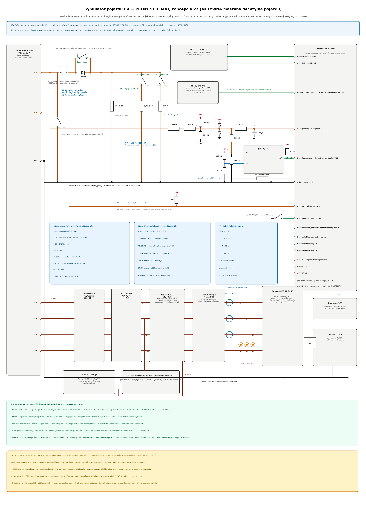

# Symulator pojazdu elektrycznego do testów ładowarek AC (v1)

**AMPERE POINT · wątek diagnostyki · 2026-09-03 · projekt urządzenia warsztatowego**

Schemat: **`AMPERE_POINT_symulator_pojazdu_schemat_PELNY.png`** — jeden arkusz
z kompletem połączeń (wklejony na następnej stronie; PNG ma pełną
rozdzielczość). Generator: `generator_schematu_symulatora.py`.



Odbiorca: technicy serwisu. Wszystkie skróty wyjaśnione przy pierwszym użyciu.

## 1. Cel i zasada działania

Do testowania ładowarek (serwis serii Q i innych) potrzebne jest „auto na
stole": urządzenie, które ładowarka widzi DOKŁADNIE jak podłączony pojazd,
które na żądanie przechodzi przez stany ładowania, pokazuje technikowi co
się dzieje, i przez które można pobierać rzeczywistą moc — dziś obciążeniem
próbnym, w przyszłości magazynem energii (pełne ładowanie trójfazowe).

Kluczowe spostrzeżenie, z którego wynika cała architektura: **pojazd niczego
do ładowarki nie „nadaje"**. Cała rozmowa auto↔stacja w ładowaniu AC (bez
komunikacji cyfrowej) to jedna linia CP (Control Pilot — pilot sterujący,
wg normy IEC 61851), na której stacja podaje przez rezystor 1 kΩ napięcie
±12 V, a pojazd tylko OBCIĄŻA tę linię rezystorem przez diodę. Napięcie,
jakie stacja widzi na CP, mówi jej wszystko o pojeździe. Skoro tak, to
wiarygodny symulator to przede wszystkim **właściwe rezystory i dioda** —
i nic więcej. Stąd zasada nadrzędna projektu (ta sama filozofia co
w rejestratorze złącza Q11):

**Rdzeń symulacji jest czysto sprzętowy** — przełącznik obrotowy wpina
rezystory przez diodę między CP a PE. Elektronika (Arduino Nano
z wyświetlaczem) jest WYŁĄCZNIE obserwatorem: mierzy i wyświetla, niczym
nie steruje. Skutki: (1) błąd programu nie może zepsuć symulacji ani
bezpieczeństwa — dla stacji symulator z martwym Nano dalej jest poprawnym
autem; (2) stacja nie jest w stanie odróżnić symulatora od pojazdu, bo
elektrycznie NIE MA różnicy.

Urządzenie ma trzy bloki:
- **rdzeń stanów** (rezystory + dioda + przełączniki) — §4,
- **obserwator** (pomiar CP/PP + wyświetlacz komunikatów) — §5,
- **tor mocy** (gniazdo Type 2 → zabezpieczenie → gniazda wyjściowe) — §6.

## 2. Jak ładowarka widzi auto — mechanizm, na którym wszystko stoi

### 2.1 Linia CP i stany

Stacja podaje na CP prostokąt ±12 V, 1 kHz, przez rezystor 1 kΩ. Pojazd
obciąża linię rezystorem do PE **przez diodę** (przewodzi tylko dodatnią
połówkę). Dodatni szczyt napięcia opada więc zależnie od rezystancji
pojazdu, a ujemny zostaje nietknięty (−12 V):

| Stan | Rezystancja CP–PE w pojeździe | Szczyt dodatni | Znaczenie |
|---|---|---|---|
| A | brak (rozwarte) | +12 V | brak pojazdu |
| B | 2,74 kΩ | ~9 V | pojazd podłączony, niegotowy |
| C | 882 Ω (= 2,74 kΩ ∥ 1,3 kΩ) | ~6 V | pojazd gotowy → stacja ZAMYKA stycznik |
| D | 246 Ω (= 2,74 kΩ ∥ 270 Ω) | ~3 V | jak C + żądanie wentylacji |
| E | zwarcie CP | 0 V | usterka |

Przykład liczbowy (stan C): prąd = (12 V − 0,6 V na diodzie) / (1000 Ω
stacji + 882 Ω pojazdu) = 6,06 mA; napięcie na CP = 0,6 + 882 × 6,06 mA =
**5,9 V** — w oknie 6 ± 1 V. Ten sam rachunek dla B daje ~9,2 V, dla D ~3,1 V.

**Po co dioda:** bez niej ujemna połówka też by opadła (w stanie C do
~−8,8 V zamiast −12 V). Stacja sprawdza ujemny szczyt — tak odróżnia
pojazd od przypadkowej rezystancji (wilgoć, uszkodzony kabel). To tzw.
kontrola diody; symulator umie ją celowo oblać (SW-F1, §4.3).

### 2.2 Wypełnienie PWM = oferta prądu

Wypełnienie prostokąta (procent czasu w górze) to oferta maksymalnego
prądu na fazę: w zakresie 10–85%: **I = wypełnienie% × 0,6 A** (16,7% →
10 A; 26,7% → 16 A; 53,3% → 32 A); w zakresie 85–96%: I = (wypełnienie% −
64) × 2,5 A. Wartości specjalne: 5% = stacja żąda komunikacji cyfrowej
(ISO 15118); brak PWM (stałe +12/+9 V) = nie wolno ładować. Pojazd nie
może pobierać więcej, niż wynika z wypełnienia — symulator to wyświetla,
a przestrzeganie limitu należy do dołączonego obciążenia (§6, §8).

### 2.3 Linia PP — kodowanie kabla

PP (Proximity Pilot — pilot obecności) informuje o obciążalności kabla:
we wtyku kabla siedzi rezystor PP–PE: 1,5 kΩ → 13 A, 680 Ω → 20 A,
220 Ω → 32 A, 100 Ω → 63 A. Pojazd (i nasz symulator) czyta tę rezystancję
i ogranicza prąd do mniejszej z wartości: oferta PWM vs kabel.

## 3. Wejście Type 2 — jak w pojeździe

Wejściem symulatora jest **panelowe gniazdo wlotowe Type 2** (takie jak
wlot w aucie): kabel stacji (Q11 ma kabel na stałe z wtykiem Type 2)
wpina się wprost, z normalną blokadą mechaniczną wtyku. Piny: L1 L2 L3 N
PE CP PP. Dla stacji z gniazdem (bez kabla) potrzebny jest zwykły kabel
Type 2↔Type 2 — wtedy PP symulatora zobaczy kodowanie tego kabla.

Wariant obciążalności: projekt bazowy = **16 A na fazę (11 kW)** — pod
serię Q11 i tani osprzęt; §9 opisuje, co zmienić dla 32 A.

## 4. Rdzeń stanów — rezystory, dioda, przełączniki

### 4.1 Przełącznik obrotowy S1 (jedna gałka = jeden stan)

Od CP, przez przełącznik usterek SW-F2 i diodę 1N4148, do trzech gałęzi
rezystorowych zamykanych stykami S1 do PE:

- pozycja **A**: wszystkie styki rozwarte (brak pojazdu);
- pozycja **B**: styk B → 2,7 kΩ;
- pozycja **C**: styki B+C → 2,7 kΩ ∥ 1,3 kΩ = 0,88 kΩ;
- pozycja **D**: styki B+D → 2,7 kΩ ∥ 270 Ω = 0,245 kΩ.

Dlaczego przełącznik obrotowy, a nie osobne przełączniki: jedna gałka
wyklucza stany bezsensowne (np. „C bez B") i odwzorowuje naturalną
sekwencję pojazdu A→B→C. Przy przejściu między pozycjami styk przełączny
daje przerwę rzędu milisekund — stacje filtrują stany dziesiątkami
milisekund, więc zwykle tego nie widzą; ewentualny restart sesji przy
przełączaniu jest zachowaniem poprawnym i udokumentowanym (§9).

### 4.2 Wartości i moce — dlaczego wystarczą zwykłe rezystory

Normowe wartości to 2740 Ω / 882 Ω / 246 Ω. Z szeregu handlowego bierzemy
2,7 kΩ + 1,3 kΩ + 270 Ω (metalizowane 1%, 0,6 W). Odchyłka 2700 vs 2740 Ω
zmienia napięcie stanu B z 9,21 na 9,18 V — o 30 mV, wobec okna ±1 V bez
znaczenia. Moce: najgorszy przypadek (zwarcie CP do stałego +12 V) daje
w stanie D 12²/246 = 0,59 W rozłożone na dwa rezystory — stąd 0,6 W
z zapasem; w normalnej pracy to pojedyncze miliwaty (stan C: 32 mW).

Dioda: 1N4148 (z zapasów koszyka a_brod) — prąd maks. ~11 mA przy
dopuszczalnych 200 mA, napięcie wsteczne 12 V przy dopuszczalnych 100 V.

### 4.3 Przełączniki usterek — celowe psucie, które stacja MUSI wykryć

- **SW-F1 — zwarcie diody** (bocznik): ujemna połówka przestaje trzymać
  −12 V (w stanie C spada do ~−8,8 V) → poprawna stacja przerywa/odmawia
  ładowania (kontrola diody). Test wykrywania „nie-pojazdu".
- **SW-F2 — przerwa CP**: pojazd „znika" mimo wpiętego wtyku → stacja ma
  przejść do stanu A/zakończyć sesję; nasz obserwator dalej widzi, co
  stacja robi (tor pomiarowy jest przed przerwą).
- **SW-F3 — zwarcie CP–PE (stan E)**: stacja widzi 0 V → natychmiastowe
  odcięcie. Prąd zwarcia tylko 12 mA (ogranicza go 1 kΩ stacji) —
  test bezpieczny.

Na obudowie: przełączniki opisane i osłonięte (dźwigniowe z osłonką albo
pod klapką) — to narzędzia testowe, nie do normalnej pracy.

## 5. Obserwator — pomiar i komunikaty

### 5.1 Pomiar CP — sieć przejęta 1:1 z rejestratora Q11

Tor: CP → 2×120 kΩ → węzeł A (100 kΩ do +5 V, 120 kΩ do masy, klamra
2×1N4148) → 10 kΩ → węzeł A′ (470 pF) → wejście A1 Nano. Przelicznik:
**U(A) = 1,82 V + 0,152 × U(CP)** (±12 V → 0…3,64 V). Wypełnienie mierzy
komparator LM393 (próg 0,455 V ≈ CP = −6 V, histereza 470 kΩ, wyjście
z podciąganiem 10 kΩ) → pin D8, przechwytywanie sprzętowe Timer1
z rozdzielczością mikrosekundową.

Dlaczego kopiujemy, zamiast projektować od nowa: sieć jest już
zrecenzowana (2 rundy przy rejestratorze), przeliczona i **sprawdzi się
nawzajem z rejestratorem** — symulator i rejestrator zmierzą to samo CP
niezależnymi egzemplarzami tego samego toru; różnica wskazań od razu
zdradza błąd montażu. Do tego części są w świeżo zamówionym koszyku
(a_brod): 120 kΩ/100 kΩ/10 kΩ z posiadanej gamy, LM393 (druga sztuka
z opakowania), 1N4148, 470 pF.

Obciążenie linii CP przez tor pomiarowy: ≤50 µA — spadek ≤50 mV na 1 kΩ
stacji, pomijalny (stany nieprzekłamane).

### 5.2 Pomiar PP

+5 V → 1 kΩ → pin PP; napięcie w węźle czyta A2. Rezystor kodujący kabla
(PP–PE) tworzy dzielnik: 1,5 kΩ → 3,0 V; 680 Ω → 2,0 V; 220 Ω → 0,9 V;
100 Ω → 0,45 V; brak kabla → 5,0 V. Wartości odległe o setki miliwoltów —
rozróżnienie pewne.

### 5.3 Komunikaty na LCD 16×2 (I2C, piny A4/A5)

Górna linia: stan i wypełnienie; dolna: wnioski i ostrzeżenia. Przykłady
(dokładne treści do dopracowania przy uruchomieniu):

```
STAN B   PWM 26,7%        STAN C   PWM 16,7%
oferta 16,0 A  kab 20A     LADOWANIE  10,0 A

STAN A  +12,0 V            PWM 5% !
stacja czeka               zada ISO 15118

BRAK PWM  +9,0 V           DIODA ZWARTA?
nie ladowac                ujemna != -12 V

POZIOM POZA OKNEM          STAN E  0 V
CP szczyt 7,4 V !          stacja odcieta
```

Reguły: poziomy klasyfikowane oknami ±1 V; „poza oknem" wyświetlane
z wartością — to główny komunikat diagnostyczny przy chorych stacjach.
Zasilanie Nano z USB (powerbank/zasilacz) — CELOWO bez związku z torem
mocy, żeby komunikaty działały w stanach A/B, zanim stacja poda napięcie.
Masa elektroniki = PE (jak w pojeździe); +5 V z USB zasila klamry, próg
i podciągania.

## 6. Tor mocy

Od gniazda Type 2: L1/L2/L3/N przewodami 2,5 mm² przez **wyłącznik
nadprądowy B16 3P+N** do **gniazda CEE 16 A 5P** (wyjście mocy — tu
w przyszłości magazyn energii) oraz mostkami z CEE do **gniazda 230 V**
(L1+N+PE) do szybkich prób jednofazowych (grzałka, obciążnica). PE
prosto z pinu PE do obu gniazd — **nigdzie nie przełączane ani nie
rozłączane**. Obecność każdej fazy pokazują trzy kontrolki 230 V
(L1/L2/L3 → N) — świecą dopiero, gdy stacja zamknie stycznik (stan C).

Opcje rekomendowane (przerywane na schemacie):
- **RCD 30 mA typ A, 4P** — stacja ma własne zabezpieczenie
  różnicowoprądowe, ale obciążenia będą dołączane ręcznie przez
  techników, więc własny wyłącznik różnicowoprądowy w symulatorze to
  tania druga warstwa ochrony;
- **licznik energii 3-fazowy na szynę DIN z wyświetlaczem** — pokazuje
  napięcia, prądy i moc W CZASIE ładowania; przy „symulacji pełnego
  ładowania" z magazynem to gotowa prezentacja wyników bez żadnego
  sprzęgania elektroniki z siecią.

Całość w rozdzielnicy hermetycznej natynkowej z płytą montażową; gniazdo
Type 2 i gniazda wyjściowe w ścianach obudowy; elektronika niskonapięciowa
odseparowana przegrodą od toru mocy.

## 7. Bezpieczeństwo

- W stanie C stacja ZAMYKA stycznik: gniazda wyjściowe są pod napięciem
  230/400 V. Praca wyłącznie z zamkniętą obudową; przed otwarciem —
  S1 do pozycji A i wypięcie wtyku Type 2.
- Montaż i każda zmiana okablowania toru mocy: przy urządzeniu wypiętym
  ze stacji. Po montażu: ciągłość PE od pinu gniazda Type 2 do bolców
  obu gniazd wyjściowych (omomierzem), brak ciągłości L↔PE i N↔PE.
- Obciążenie dołączane do gniazd musi mieć prąd ≤ oferty z wyświetlacza
  (i ≤16 A); dobór obciążenia zatwierdza prowadzący próbę.
- Przełączniki usterek osłonięte; opis na obudowie. Symulacja usterek
  tylko bez podłączonego obciążenia.
- Elektronika: zasilanie tylko z USB; żadnego połączenia z L/N.

## 8. Rozbudowa przyszła (pod magazyn energii)

- **Magazyn energii / obciążenie 3-fazowe** wpinane w CEE — symulacja
  pełnego ładowania. Wymóg: pobór ≤ oferta PWM (limit ustawiany
  w ładowarce magazynu ręcznie wg wyświetlacza symulatora).
- **Automatyczne honorowanie limitu prądu**: Nano zna ofertę z PWM —
  w przyszłości może podawać limit do magazynu (np. modbus/przekaźnik
  zezwolenia). Przewidzieć w obudowie miejsce na taki moduł.
- **Rejestracja**: Nano może streamować pomiary CP/PP po USB tak jak
  rejestrator Q11 — wspólny format logów do porównań stacji.
- **Stan D i 32 A**: gałąź D już jest; wariant 32 A wymaga wymiany
  gniazd, zabezpieczeń i przewodów (§9).

## 9. Ograniczenia przyjęte świadomie

- **16 A na fazę** (osprzęt 16 A): dla Q22/Q33 (32 A) trzeba CEE 32 A,
  B32, przewody 6 mm² i gniazdo Type 2 32 A — konstrukcja bez zmian.
- **Bez komunikacji cyfrowej (ISO 15118 / Powerline)**: symulator pokrywa
  ładowanie „analogowe" wg IEC 61851 (tak pracuje serwisowana seria Q);
  PWM 5% jest wykrywane i komunikowane, ale nie obsługiwane.
- **Blokada wtyku**: gniazdo wlotowe ma zatrzask mechaniczny wtyku, ale
  bez siłownika blokady jak w aucie — stacje tego po stronie pojazdu nie
  weryfikują (blokadę ma stacja po swojej stronie).
- **Przerwa ~ms przy przełączaniu S1** (styk przełączny): możliwy restart
  sesji — akceptowalne, bo odpowiada szarpnięciu wtyku w aucie i też jest
  scenariuszem testowym.
- **Obserwator nie mierzy toru mocy** — napięcia/prądy ładowania pokazuje
  licznik DIN (separacja elektroniki od sieci); Nano nie ma galwanicznego
  kontaktu z L/N.

## 10. Lista zakupów (ceny orientacyjne Allegro)

Rezystory sygnałowe (120 k/100 k/10 k/470 k) — z posiadanej gamy;
LM393, 1N4148, 470 pF — z koszyka a_brod (lista zakupów v2). Nowe:

| Pozycja | Ilość | Orientacyjnie | Uwagi |
|---|---|---|---|
| Gniazdo wlotowe Type 2, 16 A, panelowe | 1 | 150–250 zł | „gniazdo pojazdowe / inlet Type 2"; 5 styków mocy + CP + PP |
| Rozdzielnica hermetyczna natynkowa ≥2×12 modułów, z płytą | 1 | 60–100 zł | IP65; miejsce na DIN + elektronikę |
| Wyłącznik nadprądowy B16 3P+N | 1 | 40–60 zł | tor mocy |
| RCD 30 mA typ A, 4P | 1 | 150–250 zł | OPCJA rekomendowana |
| Licznik energii 3-faz. DIN z wyświetlaczem | 1 | 80–150 zł | OPCJA rekomendowana |
| Gniazdo CEE 16 A 5P tablicowe | 1 | 25–40 zł | wyjście mocy |
| Gniazdo 230 V tablicowe z klapką | 1 | 10–20 zł | wyjście jednofazowe |
| Kontrolka panelowa 230 V (neonowa) | 3 | 5 zł/szt. | obecność faz |
| Arduino Nano (klon) | 1 | 25–40 zł | obserwator |
| LCD 16×2 z konwerterem I2C | 1 | 15–25 zł | komunikaty |
| Przełącznik obrotowy 4-pozycyjny, 3 obwody | 1 | 15–30 zł | S1 (A/B/C/D) |
| Przełącznik dźwigniowy z osłonką | 3 | 8–15 zł/szt. | SW-F1/F2/F3 |
| Rezystor metalizowany 1% 0,6 W: 2,7 kΩ, 1,3 kΩ, 270 Ω | po 2 | kilka zł | rdzeń stanów (+zapas) |
| Rezystor 1 kΩ | 2 | z gamy | pomiar PP |
| Przewód LgY 2,5 mm² (czarny/brąz/szary/niebieski/żo-zi) | po ~1 m | ~30 zł | tor mocy |
| Końcówki tulejkowe, dławnice, opaski | — | ~20 zł | montaż |

Razem: ~380–560 zł (bez opcji ~330–420 zł). Optymalizację koszyków pod
darmowe dostawy zrobimy jak przy liście v2, po zatwierdzeniu pozycji.

## 11. Otwarte kwestie do kolejnej iteracji

- wybór konkretnego gniazda Type 2 (16 vs 32 A — decyduje docelowa seria);
- czy kupujemy opcje (RCD, licznik) od razu;
- dokładne treści komunikatów LCD — do dopracowania przy pierwszym
  uruchomieniu ze stacją;
- sposób przekazywania limitu prądu do przyszłego magazynu energii (§8);
- test przełącznika S1 na rzeczywistej stacji: czy przerwa ms powoduje
  restart sesji w serii Q (obserwacja, nie problem).

## Dziennik iteracji

**Iteracja 1 (2026-09-03).** Projekt początkowy. Decyzje architektoniczne:
rdzeń stanów czysto sprzętowy (przełącznik obrotowy + rezystory 1% +
dioda), elektronika wyłącznie obserwująca (Nano + LCD, zasilanie z USB bez
związku z torem mocy), tor mocy przelotowy 16 A z gniazdem CEE 5P pod
przyszły magazyn energii i gniazdem 230 V do prób jednofazowych, trzy
przełączniki celowych usterek (zwarcie diody / przerwa CP / stan E).
Sieć pomiarowa CP przejęta 1:1 z rejestratora Q11 (wspólne wzory, części
i wzajemna weryfikacja przyrządów). Jeden pełny schemat od pierwszego
wydania, zgodnie z konwencją przyjętą przy rejestratorze v2.
