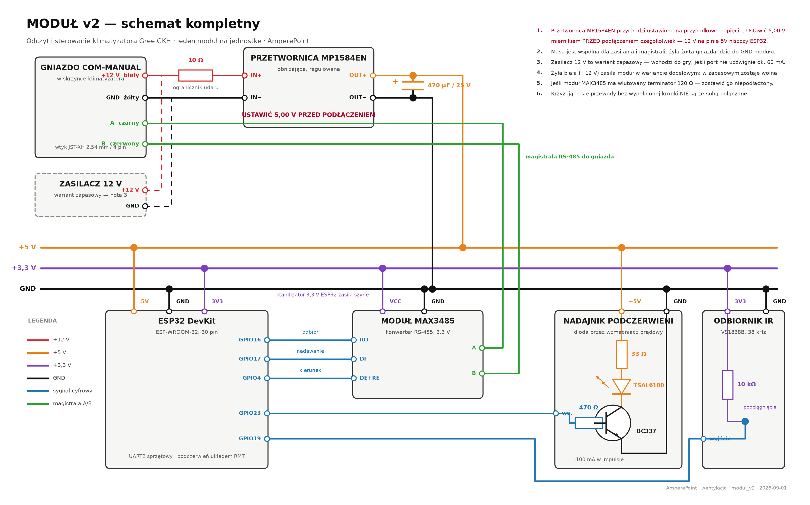

# Moduł v2 — dokumentacja kompletna

**Odczyt i sterowanie klimatyzatora Gree GKH(12)BB-K6DNA3A/I · jeden moduł na jednostkę · cztery sztuki**

Wersja 1 · 2026-09-01 · AmperePoint

Schemat połączeń: **`schemat_modul_v2.png`** w tym samym folderze — wszystkie połączenia
i zasilanie na jednym rysunku. Ten sam schemat jest osadzony niżej.

---

# 0. Schemat połączeń



Rysunek w pełnej rozdzielczości: `schemat_modul_v2.png` — powiększ w przeglądarce PDF
albo otwórz plik osobno, jeśli potrzebujesz szczegółów przy lutowaniu.

---

# 1. Co ten moduł robi

Każdy moduł obsługuje **jedną jednostkę** i realizuje dwie niezależne funkcje:

| Funkcja | Droga | Kierunek |
|---|---|---|
| **odczyt stanu** | magistrala RS-485 z portu COM-MANUAL | jednostka → moduł |
| **sterowanie** | podczerwień do okienka odbiornika jednostki | moduł → jednostka |

Rozdzielenie na dwie drogi nie jest wyborem estetycznym, tylko koniecznością:
**jednostka nie przyjmuje poleceń przez magistralę.** Rozgłasza swój stan co 800 ms i
ignoruje ramki od niezarejestrowanego sterownika — sprawdzono ponad 1100 wariantów ramek,
bez jednej odpowiedzi. Sterowanie musi więc iść podczerwienią, tak jak z pilota.

Zysk z połączenia obu dróg: **magistrala weryfikuje podczerwień**. Po każdej komendzie
moduł sprawdza na magistrali, czy jednostka faktycznie zareagowała, powtarza komendę przy
braku reakcji i zgłasza błąd, gdy nie skutkuje. Sam nadajnik podczerwieni jest ślepy i nie
dałby takiej pewności.

## 1.1 Co się zmienia wobec obecnej sondy

| Prowizorka dziś | Moduł v2 | Powód zmiany |
|---|---|---|
| bramka Modbus GRZ47-G użyta jako konwerter | układ **MAX3485** | mamy jedną bramkę, a modułów ma być cztery; znika dzielnik napięcia |
| programowy UART w ESP8266 | **sprzętowy UART** w ESP32 | koniec ramek z błędną sumą przy obciążeniu WiFi |
| dioda IR wprost z pinu, 13 mA | dioda przez **tranzystor**, ~100 mA | zasięg metrów zamiast dociskania diody do okienka |
| zasilanie z ładowarki USB | **przetwornica** z linii 12 V | moduł zamknięty w puszce, bez kabla na zewnątrz |
| brak odbiornika IR | **VS1838B** | moduł uczy się kodów z pilota i słyszy własną transmisję |

Ostatnia pozycja jest ważniejsza, niż wygląda. Dziś kody podczerwieni bierzemy z biblioteki
i wierzymy, że pasują. Odbiornik pozwoli odczytać je wprost z pilota i porównać — a przy
okazji sprawdzić, czy nadajnik w ogóle nadaje. Gdyby ten element był w układzie tydzień
temu, nie rozebralibyśmy sprawnego pilota, żeby zajrzeć w niego kamerą.

---

# 2. Wykaz elementów — jeden moduł

| Ozn. | Element | Rola | Pozycja listy zakupów |
|---|---|---|---|
| U1 | ESP32 DevKit, ESP-WROOM-32, 30 pin | sterownik | A1 |
| U2 | Moduł konwertera MAX3485 (3,3 V) | RS-485 ↔ UART | A2 |
| U3 | Przetwornica MP1584EN | 12 V → 5,00 V | A3 |
| D1 | Dioda IR TSAL6100, 940 nm | nadajnik | A4 |
| U4 | Odbiornik VS1838B, 38 kHz | uczenie kodów, kontrola | A5 |
| Q1 | Tranzystor BC337-25, NPN | wzmacniacz prądu diody | A6 |
| C1 | Kondensator 470 µF / 25 V, low ESR | zbiornik energii na szynie 5 V | A7 |
| — | Płytka uniwersalna 5×7 cm | podłoże | A8 |
| — | Listwy goldpin 2,54 mm | gniazda pod U1 i U2 | A9 |
| J1 | Złącze JST-XH 2,54 mm, 4 pin | wtyk do gniazda COM-MANUAL | A10 |
| R1 | Rezystor 33 Ω | ogranicznik prądu diody IR | z zapasów |
| R2 | Rezystor 470 Ω | rezystor bazy Q1 | z zapasów |
| R3 | Rezystor 10 kΩ | podciągnięcie wyjścia U4 | z zapasów |
| R4 | Rezystor 10 Ω | ogranicznik udaru | z zapasów |

Cztery moduły plus zapas — ilości w `..\LISTA_ZAKUPOW_ALLEGRO.pdf`.

---

# 3. Tabela połączeń

Do lutowania wygodniejsza niż rysunek — sprawdzaj wiersz po wierszu.

## 3.1 Gniazdo COM-MANUAL (wtyk J1)

| Żyła | Sygnał | Dokąd |
|---|---|---|
| biała | +12 V | przez R4 (10 Ω) do **IN+** przetwornicy U3 |
| żółta | GND | do **IN−** przetwornicy U3 **oraz** do wspólnej masy modułu |
| czarna | A | do pinu **A** modułu U2 |
| czerwona | B | do pinu **B** modułu U2 |

## 3.2 Zasilanie

| Od | Do | Uwaga |
|---|---|---|
| U3 **OUT+** | szyna **+5 V** | **najpierw ustawić 5,00 V** |
| U3 **OUT−** | szyna **GND** | |
| C1 **+** | szyna +5 V | biegunowość: pasek na obudowie = minus |
| C1 **−** | szyna GND | |
| szyna +5 V | U1 pin **5V** | |
| szyna GND | U1 pin **GND** | |
| U1 pin **3V3** | szyna **+3,3 V** | ESP32 **zasila** tę szynę, nie pobiera z niej |

## 3.3 Magistrala — U1 ↔ U2

| ESP32 | MAX3485 | Funkcja |
|---|---|---|
| GPIO16 | RO | odbiór (RX sprzętowego UART2) |
| GPIO17 | DI | nadawanie (TX) |
| GPIO4 | DE + RE zwarte razem | kierunek: niski = odbiór, wysoki = nadawanie |
| szyna +3,3 V | VCC | |
| szyna GND | GND | |

## 3.4 Nadajnik podczerwieni

| Od | Do |
|---|---|
| szyna +5 V | R1 (33 Ω) |
| R1 | anoda D1 |
| katoda D1 | kolektor Q1 |
| emiter Q1 | szyna GND |
| GPIO23 | R2 (470 Ω) |
| R2 | baza Q1 |

## 3.5 Odbiornik podczerwieni

| Od | Do |
|---|---|
| szyna +3,3 V | VCC U4 **oraz** R3 (10 kΩ) |
| R3 | wyjście U4 (podciągnięcie) |
| wyjście U4 | GPIO19 |
| szyna GND | GND U4 |

## 3.6 Przydział pinów ESP32 — uzasadnienie

| Pin | Funkcja | Dlaczego ten |
|---|---|---|
| GPIO16 / GPIO17 | UART2 sprzętowy | fabryczne piny drugiego portu szeregowego |
| GPIO4 | kierunek RS-485 | wolny, bez roli przy starcie układu |
| GPIO23 | nadawanie IR | wolny; podczerwień generuje układ RMT, nie procesor |
| GPIO19 | odbiór IR | wolny, z obsługą przerwań |

Świadomie pominięto GPIO0, 2, 5, 12 i 15 — to piny konfiguracyjne, ich stan przy włączeniu
zasilania decyduje o trybie startu układu. Podłączenie do nich czegokolwiek grozi tym, że
moduł nie wystartuje.

---

# 4. Zasilanie

Pełny rachunek: `..\ZASILANIE_OBLICZENIA.pdf`, rozdziały 12, 14 i 15. Tutaj streszczenie.

## 4.1 Skąd bierze się napięcie

```
  +12 V z gniazda COM-MANUAL  ──[ 10 Ω ]──►  MP1584  ──►  5,00 V  ──►  moduł
       (wariant docelowy)                        ▲
                                                 │
  zasilacz 230 V → 12 V  ─────────────────────────
       (wariant zapasowy)
```

Oba warianty kończą się tak samo — na wejściu przetwornicy. Różni je tylko źródło.
**Docelowo zasila port**; zasilacz wchodzi do gry, jeśli port nie udźwignie poboru.

## 4.2 Bilans

| Odbiornik | Pobór z szyny 5 V |
|---|---|
| ESP32 z WiFi, średnio | 80–120 mA |
| MAX3485 | ok. 1 mA |
| VS1838B | ok. 1 mA |
| dioda IR | ok. 100 mA, wyłącznie w impulsach po ~70 ms |
| **razem, średnio** | **100–130 mA, czyli 0,5–0,65 W** |
| **pobór z linii 12 V przez przetwornicę** | **ok. 60 mA** |

Dla porównania: obecna sonda pobiera z linii **150 mA** i to jej pobór blokował start
jednostki. Przetwornica zbija tę wartość dwuipółkrotnie — na tym polega cała nadzieja
wariantu docelowego.

## 4.3 Rzecz, która niszczy moduł

**Do pinu `5V` ESP32 nigdy nie wolno podać 12 V.** Za tym pinem siedzi stabilizator 3,3 V;
przy 12 V musiałby zutylizować 8,7 V, a ESP32 w szczycie nadawania pobiera do 250 mA —
to ponad 2 W w małej obudowie.

Uwaga jest niebanalna, bo **obecna sonda znosi 12 V bez problemu**: WeMos D1 R1 ma wejście
VIN przewidziane na 9–24 V. Odruch przeniesiony z tamtej płytki na ESP32 kończy się
zniszczeniem układu.

## 4.4 Marginesy elementów

| Element | Wytrzymałość | Obciążenie | Zapas |
|---|---|---|---|
| MP1584, wejście | 4,5–28 V | 12 V | w środku zakresu |
| MP1584, prąd wyjścia | 3 A | 0,13 A | **23×** |
| kondensator C1 | 25 V | 5 V | **5×** |
| stabilizator 3,3 V ESP32 | ok. 0,5 W ciągłe | 0,2 W średnio | wystarcza |
| tranzystor Q1 | 800 mA | 100 mA | **8×** |
| dioda D1 | 100 mA ciągłe | 100 mA impulsowo | praca impulsowa, w normie |

Żaden element nie pracuje blisko granicy.

## 4.5 Skąd wzięły się wartości rezystorów

**R1 = 33 Ω** — ogranicznik prądu diody:
R = (5 V − 1,35 V spadku na diodzie − 0,2 V na nasyconym tranzystorze) ÷ 0,1 A ≈ 34 Ω.
W impulsie traci 0,33 W, ale nośna 38 kHz ma około połowy wypełnienia, a paczka trwa
~70 ms — moc średnia jest pomijalna, element 0,25 W wystarcza.

**R2 = 470 Ω** — rezystor bazy:
I_B = (3,3 V − 0,7 V) ÷ 470 Ω ≈ 5,5 mA, przy dopuszczalnych 12 mA z pinu ESP32.
Przy wzmocnieniu BC337 rzędu 100 daje to pełne nasycenie przy 100 mA kolektora.

**R3 = 10 kΩ** — podciągnięcie wyjścia odbiornika, wartość typowa dla VS1838B.

**R4 = 10 Ω** — ogranicznik udaru przy wpinaniu wtyku. Przy 60 mA traci 0,036 W, czyli
nic; w chwili wpięcia ogranicza prąd ładowania kondensatorów wejściowych przetwornicy
do ok. 1,2 A przez ułamek milisekundy.

---

# 5. Montaż

## 5.1 Kolejność, która nie wybacza zmian

1. **Ustawić przetwornicę na 5,00 V** — zasilić ją samą z 12 V, zmierzyć wyjście
   miernikiem, dokręcić potencjometr. **Do niczego jeszcze nie podłączać.**
2. Wlutować podstawki goldpin pod U1 i U2 — układy mają dawać się wyjąć bez lutownicy.
3. Wlutować elementy bierne: R1–R4, C1 (uwaga na biegunowość), Q1, D1, U4.
4. Osadzić U1 i U2 w podstawkach.
5. Wlutować wiązkę do wtyku J1.
6. Sprawdzić omomierzem, że **między szyną +5 V a GND nie ma zwarcia**.
7. Dopiero teraz podać zasilanie.

## 5.2 Umiejscowienie w jednostce

| Element | Gdzie | Dlaczego |
|---|---|---|
| płytka modułu | w skrzynce elektrycznej klimatyzatora | zamknięta, bez kabli na zewnątrz |
| dioda D1 | **przyklejona naprzeciw okienka odbiornika** | TSAL6100 ma wąską wiązkę i wymaga celowania |
| odbiornik U4 | obok D1, skierowany w pomieszczenie | ma widzieć pilota użytkownika |

Umiejscowienie diody jest krytyczne i wynika z doświadczenia: pierwszy udany test
sterowania powiódł się dopiero, gdy dioda dotykała okienka odbiornika. Z tranzystorem
zasięg będzie znacznie większy, ale kierunek nadal ma znaczenie.

## 5.3 Bezpieczeństwo

- Wpinanie i wypinanie wtyku z gniazda COM-MANUAL **wyłącznie przy wyłączonym bezpieczniku**.
- W skrzynce jednostki jest 230 V, a czynnik R32 jest palny — bez iskrzenia przy jednostce.
- W wariancie z zasilaczem: podłączenie do zacisków 230 V przy wyłączonym bezpieczniku,
  zaciski zasilacza zaizolowane.

---

# 6. Uruchomienie — kryteria zaliczenia

Wykonać **na jednym module**, przed montażem pozostałych trzech.

| # | Test | Kryterium zaliczenia | Gdy nie przechodzi |
|---|---|---|---|
| 1 | napięcie na wyjściu przetwornicy | 4,95–5,05 V | poprawić potencjometrem |
| 2 | moduł startuje i łączy się z WiFi | widoczny w sieci | sprawdzić zasilanie i lutowanie |
| 3 | odczyt magistrali | ramki co 800 ms, błędne sumy poniżej 1% | sprawdzić polaryzację A/B |
| 4 | **napięcie linii +12 V pod obciążeniem** | **≥ 11 V** | przejść na wariant zapasowy |
| 5 | **trzykrotne przełączenie bezpiecznika** | **jednostka wstaje za każdym razem** | przejść na wariant zapasowy |
| 6 | komenda podczerwienią | magistrala potwierdza zmianę w ciągu 15 s | poprawić celowanie diody |
| 7 | temperatura po godzinie pracy | elementy letnie, nie parzące | sprawdzić napięcie przetwornicy |

**Testy 4 i 5 są rozstrzygające dla całej koncepcji zasilania.** Ich niepowodzenie nie
przekreśla projektu — oznacza tylko przejście na zasilacz, który jest już sprawdzony.

---

# 7. Oprogramowanie

**Gotowe.** Źródło: `firmware\modul_v2\modul_v2.ino` w tym folderze.
Kompiluje się bez ostrzeżeń: 83% pamięci programu, 16% pamięci dynamicznej.

## 7.1 Co się zmieniło wobec sondy v10

| Element | Sonda v10 (ESP8266) | Moduł v2 (ESP32) |
|---|---|---|
| odbiór magistrali | programowy UART, ok. 9% ramek z błędną sumą | **sprzętowy UART2** |
| pamięć nastaw | EEPROM z ręczną sumą kontrolną | **NVS** (`Preferences`) |
| odbiór podczerwieni | brak | **VS1838B: nauka kodów i echo** |
| strażnik pamięci | próg na największym spójnym bloku | próg na wolnej stercie |
| tryby diagnostyczne | fala, skan pinów, przemiat 24 protokołów | **usunięte** — służyły do problemów już rozwiązanych |

## 7.2 Echo nadajnika — test niezależny od klimatyzatora

Najważniejsza nowa funkcja. Po każdej wysyłce moduł **włącza własny odbiornik i sprawdza,
czy usłyszał to, co przed chwilą nadał**. Rozstrzyga to pytanie, na które przez tydzień
nie mieliśmy odpowiedzi: czy dioda w ogóle świeci.

| Echo | Potwierdzenie z magistrali | Wniosek |
|---|---|---|
| słychać | tak | wszystko działa |
| słychać | nie | nadajnik sprawny, **problem z celowaniem** w okienko jednostki |
| cisza | nie | **usterka toru diody** — tranzystor, rezystor, lutowanie |

Bez tego rozróżnienia każda awaria wyglądała tak samo. Testu kamerą telefonu, który nas
zmylił, nie trzeba już nigdy robić.

## 7.3 Interfejs sieciowy

Adresy `/stan` i `/ustaw` działają **identycznie jak w v10**, więc karta panelu w Home
Assistancie nie wymaga żadnych przeróbek. Doszły tylko nowe pola JSON:

| Pole | Znaczenie |
|---|---|
| `ir_echo` | `slychac` / `cisza` / `brak` — wynik testu z 7.2 |
| `ir_ostatni_protokol` | protokół ostatniego kodu odebranego z pilota |
| `ir_ostatni_kod` | ten kod zapisany szesnastkowo |
| `modul` | nazwa egzemplarza, żeby odróżnić cztery moduły |

## 7.4 Komendy przez telnet (port 23)

| Komenda | Działanie |
|---|---|
| `INFO` | adres, czas pracy, pamięć, liczniki ramek |
| `NAUKA` | 60 s nasłuchu — naciśnij przycisk pilota celując w odbiornik modułu |
| `IR ON` / `IR OFF` | włącz / wyłącz jednostkę |
| `IR TEMP 24` | nastawa 16–30 |
| `IR TRYB cool` | `cool` / `heat` / `dry` / `fan` / `auto` |
| `IR WENT 2` | `auto` / `1` / `2` / `3` |
| `RESET` | restart modułu |

## 7.5 Wgrywanie

**Pierwszy raz — kablem USB**, bo aktualizacja przez WiFi wymaga działającego firmware'u:

```
arduino-cli compile --fqbn esp32:esp32:esp32 firmware\modul_v2
arduino-cli upload  --fqbn esp32:esp32:esp32 -p COMx firmware\modul_v2
```

Kolejne aktualizacje przez WiFi, bez zdejmowania modułu z sufitu.

## 7.6 Cztery egzemplarze — jedna rzecz do zmiany

Przed wgraniem na każdy moduł zmień **jedną stałą** na początku pliku:

```
const char* NAZWA_OTA = "modul-gree-1";   // 1, 2, 3, 4
```

Ta nazwa jest jednocześnie adresem dla aktualizacji przez WiFi, treścią rozgłoszenia
w sieci i polem `modul` w JSON-ie. **Cztery moduły o tej samej nazwie będą się gryzły.**

Moduł rozgłasza po sieci co 2 s pakiet `MODUL-GREE <nazwa> <adres IP>` na porcie UDP 4210 —
dzięki temu znajdziesz go nawet po zmianie adresu przez router.

---

# 8. Co pozostaje nierozstrzygnięte

| Kwestia | Stan |
|---|---|
| **czy port udźwignie 60 mA** | nieznane; 150 mA blokowało start, progu nie znamy — rozstrzygają testy 4 i 5 |
| rozstaw wtyku JST | przyjęto XH 2,54 mm na podstawie tego, że wtyk pasował do gniazda programatora — do potwierdzenia miarką |
| który protokół IR zadziałał | sterowanie działa na protokole Gree (wariant YAW1F); komenda `NAUKA` pozwoli porównać to z kodem prawdziwego pilota |
| terminator na module MAX3485 | jeśli wlutowany — zostawić niepodłączony; magistrala jest krótka i wolna (1200 bps) |

---

# 9. Dokumenty powiązane

| Dokument | Zawartość |
|---|---|
| `schemat_modul_v2.png` | **schemat połączeń — ten sam folder** |
| `..\ZASILANIE_OBLICZENIA.pdf` | pełny rachunek zasilania, historia trzech nieudanych podejść |
| `..\LISTA_ZAKUPOW_ALLEGRO.pdf` | wykaz zakupów z linkami, sprawdzona dostępność |
| `..\FAZA2_USTALENIA.pdf` | dlaczego magistrala nie przyjmuje poleceń |
| `..\DEKODOWANIE_POSTEP.pdf` | mapa pól ramki rozgłoszeniowej |
| `..\panel\README.pdf` | karta panelu w Home Assistancie |
